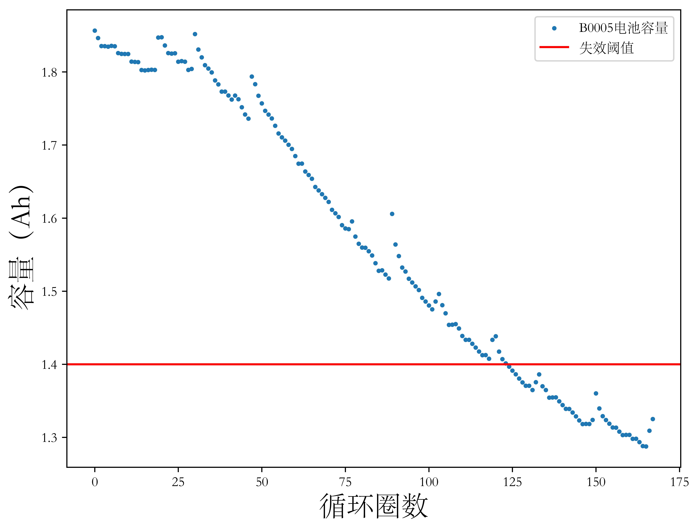

## 1.1 研究背景及研究目的和意义

为应对全球气候变暖情况，缓和能源供应短缺现状，我国于2020年9月提出双碳目标。根据中国汽车工业协会发布资料，截至2021年底，全国新能源汽车保有量达到784万辆，其中纯电动汽车保有量为640万辆，占比82%。电动汽车技术和电动汽车行业的快速稳步发展将为国家实现双碳战略目标做出突出贡献、承担更多责任。

动力电池，尤其是电动汽车动力电池，主要使用镍氢电池、镍镉电池和锂离子电池。锂离子电池优点众多，包括：1）体积小、重量轻但反应活性强且能量密度高，能够有效减小动力系统体积和重量，一方面提高电动汽车续航时间，另一方面为后续部署大型传感器实现车辆自主感知和导航提供基础；2）工作电压高，有利于减小能量损失，提高电机驱动效率；3）自放电率高，意味着锂离子电池不需要完全放电就可以充电而不会产生不良影响；4）工作温度范围广；5）循环寿命长且退役后处理回收过程环保无污染。这些优点使得锂离子电池已经成为现阶段电动汽车最重要的动力源【文献】。反观传统镍氢电池和镍镉电池，随着用电系统的要求日益提高，其由于不适合插入式充电、自放电率高、循环寿命短、低温性能差和退役后无害化成本高等原因，已经逐渐退出市场。除新能源汽车动力电池领域外，锂离子电池同样是消费类电子产品、医疗设备、电网储能设备和航空航天等领域的重要组成部分。

随着充放电循环的进行，锂离子电池的性能状态会发生退化，当性能状态退化至低于某个阈值时，称其达到寿命终点（End of Life，EOL），此时若不及时更换，则发生电源故障的概率大大增加。随着锂离子电池在上述场景中使用规模的日益扩大，其自身存在的充放电管理和性能退化等安全性和可靠性方面问题变得越发重要，逐渐成为研究热点【文献】。锂电池的健康状态（State of Health，SOH）和寿命状态（State of Life，SOL）直接影响系统的运行状态，多项实践和案例表明系统故障或失效的主要原因是电源系统故障，如曾经获得广泛关注的比亚迪混合动力汽车自燃事件、特斯拉多次起火事件和三星手机电池爆炸事件等，造成这些事故的原因之一正是电池性能退化。

电池故障会在人身安全、设备设施、生态环境、公司名誉等方面造成巨大损失，有必要对锂离子电池SOH进行监控和管理。为此引入电池管理系统（Battery Management System，BMS）实现电池运行时的数据采集、结合算法进行状态估计并以此为依据实现电池充放电控制、电池均衡和电池热管理等功能。具体地，BMS的重要任务是通过不断监控电池状态、评估电池健康信息确定是否实施视情维修（Condition-Based Maintenance，CBM），而CBM的关键在于对电池进行准确的故障预测，这包含两部分，其一是对电池SOH的估计过程，其二则是根据SOH估计电池距离故障发生还有多少时间（或循环）剩余的过程，换言之是对电池剩余寿命（Remaining Useful Life，RUL）的预测。BMS的引入确保动力电池在合理安全的范围内工作并使得异常情况能被及时发现并得到人工干预处理从而提前排除安全隐患以延长电池循环寿命、降低使用成本，电池SOH估计和RUL预测是BMS实现的核心任务【文献】。

对锂离子电池容量的准确预测是一个很具挑战的任务。锂离子电池是一个复杂的电化学系统，其退化过程受到包括电极材料、负载工况和环境温度等在内的很多不确定性因素影响，表现出很强的不确定性。SOH作为电池的内部参数，无法直接测量，需要构造合适的健康因子（Health Indicator，HI），并建立健康因子和可测量量（如电压、电流、温度等）之间的复杂非线性关系。目前已有的方法如基于电化学机理模型的方法等普遍存在建模困难、求解困难和需要大量人工干预过程等问题，往往难以满足较为准确的在线预测需求。

针对这个问题，集合数据驱动方法的非侵入性和高性能等特点，本课题以电动汽车领域锂离子电池应用场景为背景，基于锂离子电池历史容量退化数据，不依赖电池退化机理模型，开展基于数据驱动方法（尤其是神经网络相关方法）的锂离子电池健康状态预测方法研究，以适应电动汽车领域对电池高可靠性需求。本文的研究方法还可以迁移到类似场景中，为其他锂离子电池应用问题提供参考借鉴。综上，本文研究内容具有一定的理论意义和实用价值。

## 1.2 国内外研究现状

### 1.2.1 锂离子电池健康状态估计和剩余寿命预测概述

随着电池充放电循环，其内部发生的物化过程，如锂存量损失、电极活性材料损失和固体电解质界面膜生成，导致电池性能衰退，表现在指标上是电池容量衰退和内部阻抗增加。大多数研究使用电池容量定义电池SOH，如【式1-1】所示。

$$ SOH = \frac{C_{act}}{C_{norm}} \tag{1-1}$$

其中 $C_{act}$ 表示电池在当前循环下可以释放的最大容量，也即实际容量，$C_{norm}$ 表示电池的额定容量。需要区分SOH定义中当前循环下可释放的最大容量和当前时刻可释放容量，后者一般表示为 $Q$，用于定义电池荷电状态（State of Charge，SOC），其与电池容量退化趋势相关性较弱。使用容量定义电池SOH，失效阈值一般定义为额定容量的70%~80%，低于此值时认为电池失效，需要更换。

<figure>
<figcaption>图1-1 电池性能退化与失效阈值示意图</figcaption>

</figure>

以【图1-1】为例说明SOH和RUL的关系，【图1-1】横坐标为电池充放电循环周期数，纵坐标为电池每次循环的放电容量。零时刻点处电池的实际容量即为额定容量，随着充放电循环的进行，容量呈现下降趋势。锂离子电池的RUL预测通过当前时刻前的历史容量退化数据学习退化特征，刻画退化模型，并从当前时刻开始预测未来时刻容量直到容量达到失效阈值。从当前时刻开始到失效时刻经历的充放电循环数即为电池剩余寿命。

分析其形态可以得知，电池的容量退化曲线早期变化缓慢，后期加速变化，整体呈现非线性递减趋势，且随着电池结束充放电进入静置状态其容量存在再生（即容量回升）现象导致曲线存在局部震荡，使得长周期RUL预测极具挑战性。

### 1.2.2 锂离子电池健康状态估计和剩余寿命预测研究现状

目前，针对锂离子电池健康状态估计和剩余寿命预测的方法主要分为两类，分别是基于模型的方法和数据驱动的方法，以下分别介绍。

#### 1.2.2.1 基于模型的方法

基于模型的方法从锂离子电池工作原理入手，从电化学反应机理角度分析并建立老化模型，通常包括电化学模型、等效电路模型和经验模型等。

如Zhang等【文献】建立了电池单粒子老化模型，描述电池内部物化反应过程并分析老化过程和状态变量之间的关系。Sankarasubramanian等【文献】基于Zhang等【文献】工作中对锂离子电池反应式产生的固体电解质界面膜增厚机理建立电池容量衰退模型，实现电池RUL预测。Waag等【文献】研究固定温度下磷酸铁锂电池的电化学阻抗模型，其以电极容量和扫描电极显微镜的栅数为输入，建立的模型能够反应电极退化和电池性能老化现象。值得注意的是，机理模型往往和滤波器或观测器配合使用以实现在线的电池容量估计。如Zheng等【文献】基于经验模型，使用两个扩展卡尔曼滤波器（Extended Kalman Filter，EKF）分别估计阿伦纽斯模型（Arrhenius Mode）的参数和电池容量。基于机理模型的方法目前已经相当成熟。Zhang等【文献】总结了包括电化学模型、等效电路模型和黑箱模型等在内的常用机理模型。Li等【文献】基于等效电路模型分析不同滤波器的性能表现。

基于模型的方法在外部条件稳定、工作状况一致性强的条件下往往能得到较为准确的结果，但其应用过程中有如下缺陷：1）要求对电池老化机理有充分的先验知识，否则将极大降低预测结果的准确性；2）鲁棒性差，当外部条件变化，如施加可变电流或温度变化时，很难获得准确的机理模型，且严重依赖于电极材料，应用限制很大；3）往往设计侵入式和破坏性测量，不适用于需要在线预测的电动车场景电池SOH估计。

#### 1.2.2.2 数据驱动方法

不同于基于模型的方法，数据驱动方法不要求对电池容量衰退内部机理有充分了解。数据驱动模型使用历史衰退数据作为输入，提取数据中具有代表性的特征并以此为依据进行预测。

一类曾经流行的数据驱动锂离子电池SOH估计方法是增量容量分析法（Incremental Capacity Analysis， ICA），这类方法通过观察增量容量（Incremental Capacity，IC）曲线和差分电压（Differential Voltage，DV）曲线的形态提取特征并以此为依据进行SOH估计和RUL预测。具体地，IC曲线是电池容量（Q）对端电压（V）的导数(dQ/dV)与端电压的关系曲线，DV曲线是端电压对容量的导数(dV/dQ)与容量的关系曲线，IC曲线通过微分操作将电压曲线平台区上的微小变化转化为容易观察的波峰，ICA方法模型以IC曲线波峰的幅值、位置、形状和面积等信息为特征，推断电池老化的模型和机理进而实现电池SOH估计。如Li等【文献】从IC曲线中观察到的5个特征中提取了2个波峰和1个波谷用于电池SOH估计。这种方法的实施不依赖具体的电池机理模型，但仍需要手动提取特征。另一方面，ICA方法对数据获取时电池的荷电状态及冲放电流有较严格限定，这与实际工况不符。ICA方法的应用因此被限制。

机器学习（Machine Learning，ML）/深度学习（Deep Learning，DL）算法具有自动特征提取的能力，并且在非线性问题上有着很出色的性能表现。这使得包括支持向量机（Support Vector Machine，SVM）、相关向量机（Relevance Vector Machine，RVM）和卷积神经网络（Convolutional Neural Network，CNN）等在内的一系列相关算法逐渐成为主流。

SVM利用核函数将样本数据升到高维（特征空间）从而将非线性问题转化为线性问题。Pan等【文献】通过多核支持向量机预测锂离子电池寿命，其使用了多项式核和高斯核，通过粒子群优化算法确定模型参数。将支持向量机应用在回归问题上，称为支持向量回归（Support Vactor Regression，SVR），SVR具备描述输入和输出数据之间的非线性相关性的能力，从而在电池寿命预测问题中同样适用。Ma等【文献】使用差分进化算法（Differential Evolution，DE）和SVR融合模型进行电池RUL预测，其中，差分进化模型被用于优化支持向量回归时的关键参数。RVM作为核回归的稀疏贝叶斯方法，和SVM非常相似，但它以概率的方式进行回归。Lee等【文献】提出了一种RVM和平均熵（Mean Entropy，ME）结合的方法，其中ME为时间序列重建生成最优嵌入维数，RVM随后预测电池SOH和RUL。

一般而言，卷积神经网络由卷积层、池化层和全连接层组成。卷积层完成卷积和激活两个步骤，卷积操作中，往往设置一个滑动窗口以和卷积核保持相同的尺寸，输入矩阵和卷积核完成卷积操作后加上偏置值，此输出结果称为特征图。卷积的结果作为激活函数的输入，激活函数提供非线性变换。池化层实现样本的降采样，在池化过程中，特征图的主要特征被保留，次要特征则被提出，这样做能降低训练过程的计算开销。全连接层将分布在特征图中的特征表示映射到样本标记空间以减少特征位置对预测结果的影响。Shen等【文献】使用充电过程中随机选择的固定循环周期的容量曲线分段、电压曲线分段和电流曲线分段通过CNN实现电池容量在线预测，并据此实现电池剩余寿命预测。CNN模型不仅能处理一维数据，同样也能处理二维数据，使得这种模型能够保留更多时空信息。Li等【文献】提出了一种时序信号-图像变换，使用原始的温度、电压和电流分段数据作为输入，使用LetNet-5网络实现电池SOH在线预测。Hong等【文献】在一维CNN的基础上引入空洞卷积（Dilated Convolutions），极大提高了使用卷积神经网络进行电池SOH预测的速度。

多种机器学习/深度学习方法往往相互结合融合方法以应对更复杂的情况或获得更精确而全面的结果，对CNN也是如此。Yang等【文献】融合了CNN和长短期神经网络（Long Short Term Memory Network，LSTM），这项工作使用CNN进行特征提取，提取的结果作为双向长短期记忆网络（Bi-LSTM）的输入。除了机器学习/深度学习方法，CNN同样也可以和经典信号处理方法结合。如Ding等【文献】结合小波包分解方法（Wavelet Package Decomposition，WPD）和CNN，在这一方法中，充放电时的电流被WPD分解为一系列子信号以突出电池性能退化过程中的非线性信息，然后通过无监督CNN从中习得特征并以此进行RUL预测。

## 1.3 本文主要研究内容和组织结构

根据对研究现状的调研整理，发现针对锂离子电池SOH估计和RUL预测的各种方法有不同的应用条件限制，在适用性和性能等方面存在各自优缺点。基于机理模型的方法不需要大量历史退化数据，在建模准确的情况下有很高的预测精度，但依据物化过程建立准确的锂电池机理模型需要大量的先验知识，且建立的模型对内外部条件变化非常敏感，造成应用上有很大难度。基于数据驱动视角的ICA方法不需要关于研究对象的准确且完备的知识，通过数学变换将退化特征反映在充放电特征曲线上，但这种方法避免不了手动提取特征，同时对电池SOC和充放电电流等参数区间有限制，同样造成实际应用难度。同样是基于数据驱动的机器学习/深度学习方法解决了ICA方法中需要手工提取特征的缺陷，同时摒弃了其对工况的限制，尽管要使这类模型实现较好的预测性能需要大量电池历史退化数据，但大量公开的电池数据集克服了这一难点，同时通过合理的超参数设置及融合模型的引入，有效降低了过拟合风险。

考虑到近年来深度学习方法的兴起，及其在实现难度、预测性能和部署可能性方面的优势，本课题围绕锂离子电池运行过程中的健康状态估计和剩余寿命预测问题，开展基于历史容量退化数据的锂离子电池健康状态估计方法、基于充放电过程直接测量数据的锂离子电池健康状态估计方法和基于充放电过程测量数据的锂离子电池剩余寿命预测方法三个方面的研究。

本文共六章，结构和各章内容安排如下。

第一章为绪论，这一章介绍了选题背景、意义和研究内容；继而针对与锂离子电池健康状态估计和剩余寿命预测相关的国内外研究现状进行总结和讨论，详细说明了锂离子电池剩余寿命的定义及其与锂离子电池健康状态的关系，重点分析数据驱动方法相对基于模型的方法的优势；最后提出本文研究内容。

第二章首先以磷酸铁锂材料电池为例简要介绍了锂离子电池的基本工作原理并据此分析锂离子电池性能退化机理；继而展示锂离子电池在循环过程中的容量、内阻、电压、电流、温度等参数的变化情况，为后文数据驱动模型的输入数据选择奠定了基础；最后介绍本文使用的四个开源数据集的基本情况，重点分析数据集组成和采用的充放电协议。

第三章以锂离子电池的历史容量退化数据集为模型输入，将锂离子电池的性能退化问题化归为一元时间序列预测问题；介绍了卷积神经网络和长短期记忆神经网络的结构和原理，分别实现了自回归模型、支持向量回归模型、多层感知机模型、卷积神经网络模型和长短期记忆神经网络模型并比较其预测性能。

第四章针对实际应用难以获得容量退化数据的问题，探究使用原始循环数据作为输入的预测方法；本章介绍了一种融合了滑动窗口策略的时间序列-图像变换方法将输入的时序数据转换为多通道图像以增强数据的空间相干性和（相对于整个充放电周期的）起点鲁棒性；进一步地，本章拓展了前一章用于处理单变量的卷积神经网络模型，使其能够适应多元变量输入；最后，本章将常见的电流-电压-温度特征组合换为电流-电压-电荷特征组合，证明了后者对预测精度的积极作用。

第五章以锂离子电池剩余寿命预测为中心，说明了常见以循环定义的电池剩余寿命在实际应用中的局限性，介绍了一种新的电池剩余寿命定义方法并基于此定义实现了用于电池剩余寿命预测的长短期记忆神经网络模型。

第六章总结全文内容并展望未来工作。