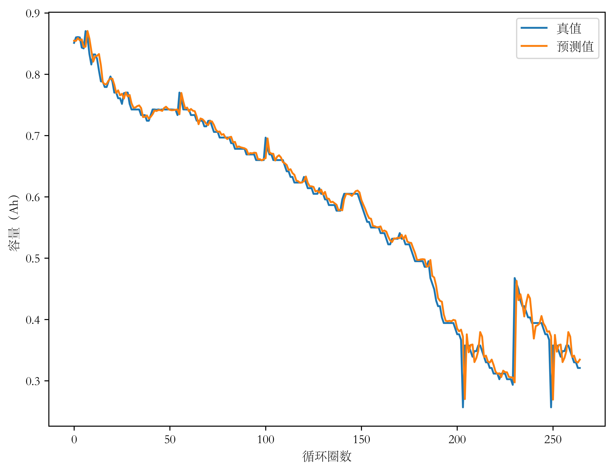
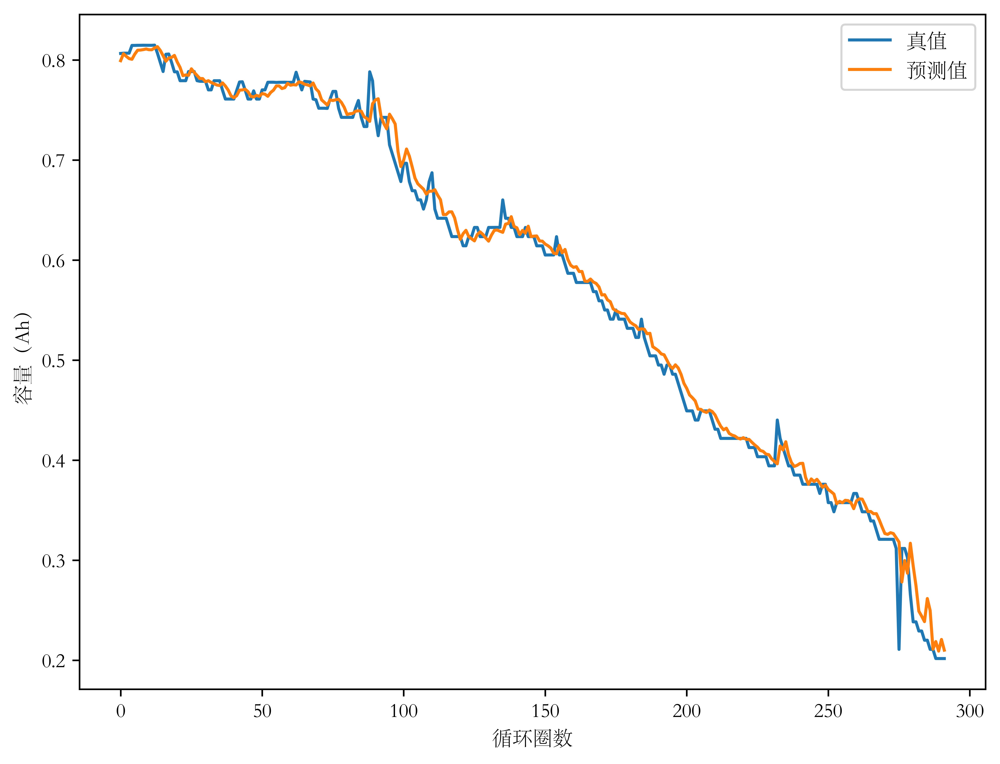
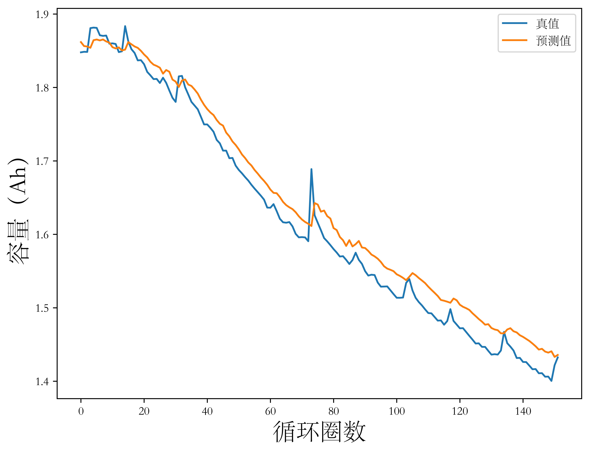
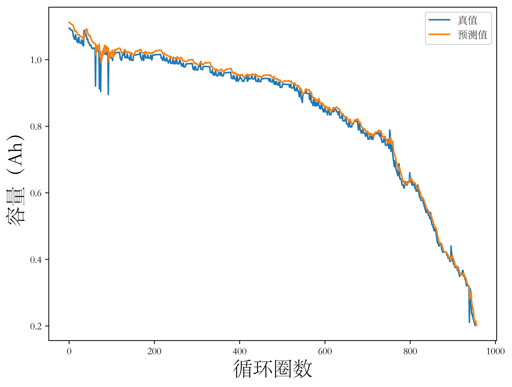
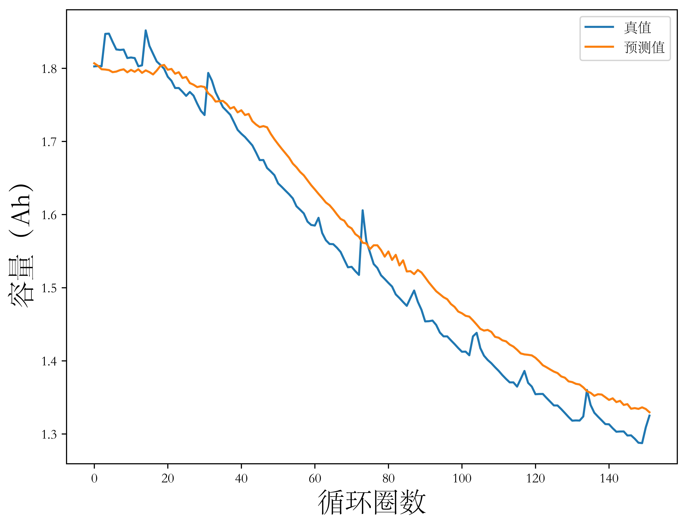
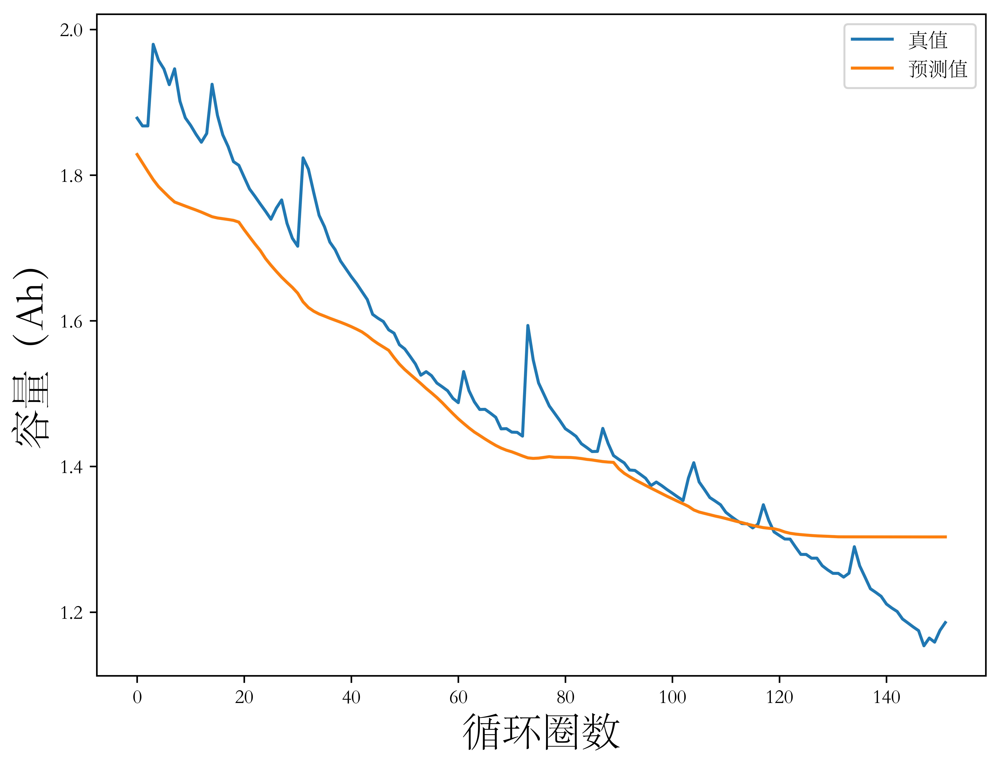

## 3.1 引言

在锂离子电池健康状态估计和剩余寿命预测的数据驱动方法早期研究中，研究人员通常使用单一健康因子表征电池退化状态，数据驱动模型通过健康因子的历史变化数据预测其下一时间步的数值并重新映射回电池健康状态。

本章在仔细调研文献和详尽分析锂离子电池公开数据集的基础上，采用NASA数据集和CALCE数据集，使用

开展基于历史容量数据的锂离子电池健康状态研究。

## 3.2 基于长短期记忆神经网络的电池健康状态直接估计方法

### 3.2.1 长短期记忆神经网络原理

（RNN）

（RNN存在的问题以及LSTM是如何解决它的）

（使用LSTM实现时间序列预测）

以深度学习的视角，锂离子电池SOH估计问题可以看做时间序列预测（Time Series Forecast）问题，更具体地，采用历史容量退化数据进行SOH估计的问题属于单变量有监督时间序列回归（Supervised Univariate Time Series Regression）问题。

### 3.2.2 长短期记忆神经网络模型

## 3.3 基于卷积神经网络的电池健康状态直接估计方法

### 3.3.1 卷积神经网络原理

尽管卷积神经网络主要被用于计算机视觉领域，但许多文献表明，通过设置特殊网络结构或对输入的时间序列稍加处理，CNN同样具备时间序列处理。

### 3.3.2 卷积神经网络模型

## 3.4 实验结果与分析

cnn、lstm（深度神经网络）结果和ar、svr、mlp（机器学习方法/浅层神经网络）方法对比

均方根误差（RMSE）

平均绝对误差（MAE）

最大误差（MaxE）

<figure>
<figcaption>图3- AR模型在CALCE数据集上的预测结果</figcaption>

</figure>

<figure>
<figcaption>图3- AR模型在NASA数据集上的预测结果</figcaption>

</figure>

<figure>
<figcaption>图3- SVR模型在CALCE数据集上的预测结果</figcaption>

</figure>

<figure>
<figcaption>图3- SVR模型在NASA数据集上的预测结果</figcaption>

</figure>

<figure>
<figcaption>图3- MLP模型在CALCE数据集上的预测结果</figcaption>

</figure>

<figure>
<figcaption>图3- MLP模型在NASA数据集上的预测结果</figcaption>

</figure>

<figure>
<figcaption>图3- LSTM模型在CALCE数据集上的预测结果</figcaption>

</figure>

<figure>
<figcaption>图3- LSTM模型在NASA数据集上的预测结果</figcaption>

</figure>

<figure>
<figcaption>图3- CNN模型在CALCE数据集上的预测结果</figcaption>

</figure>

<figure>
<figcaption>图3- CNN模型在NASA数据集上的预测结果</figcaption>

</figure>

## 3.5 本章小结

本章详细介绍了CNN和LSTM两种网络的原理。