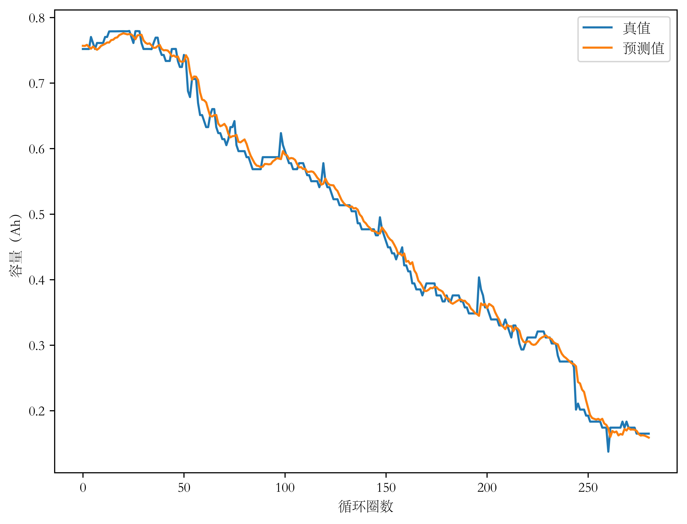
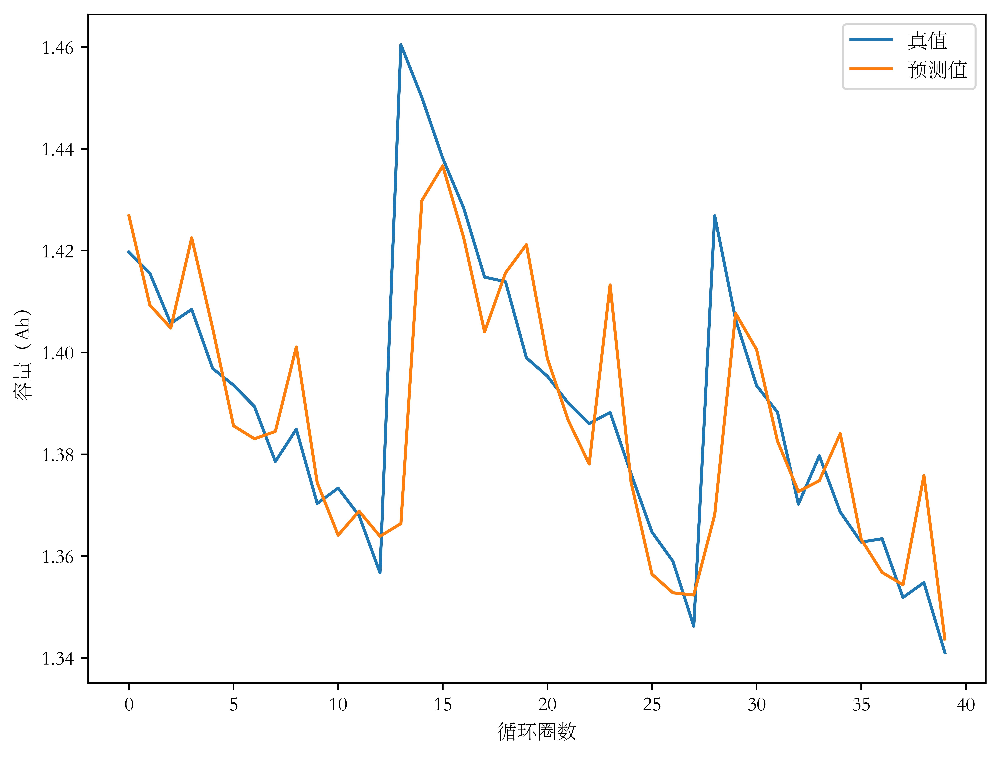
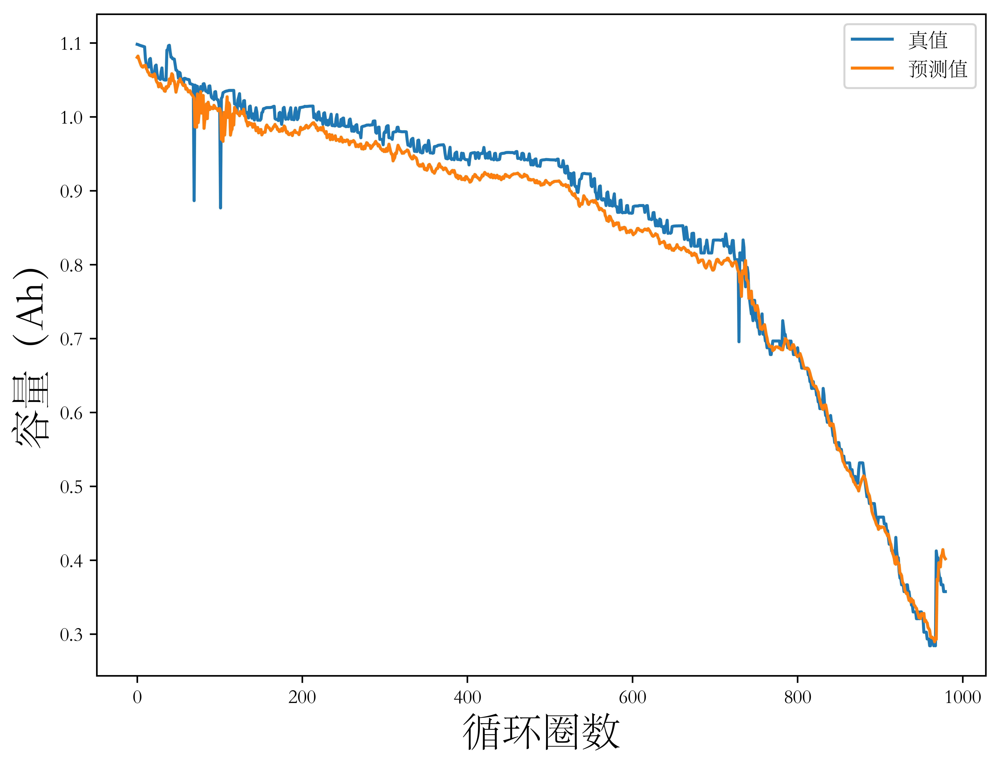
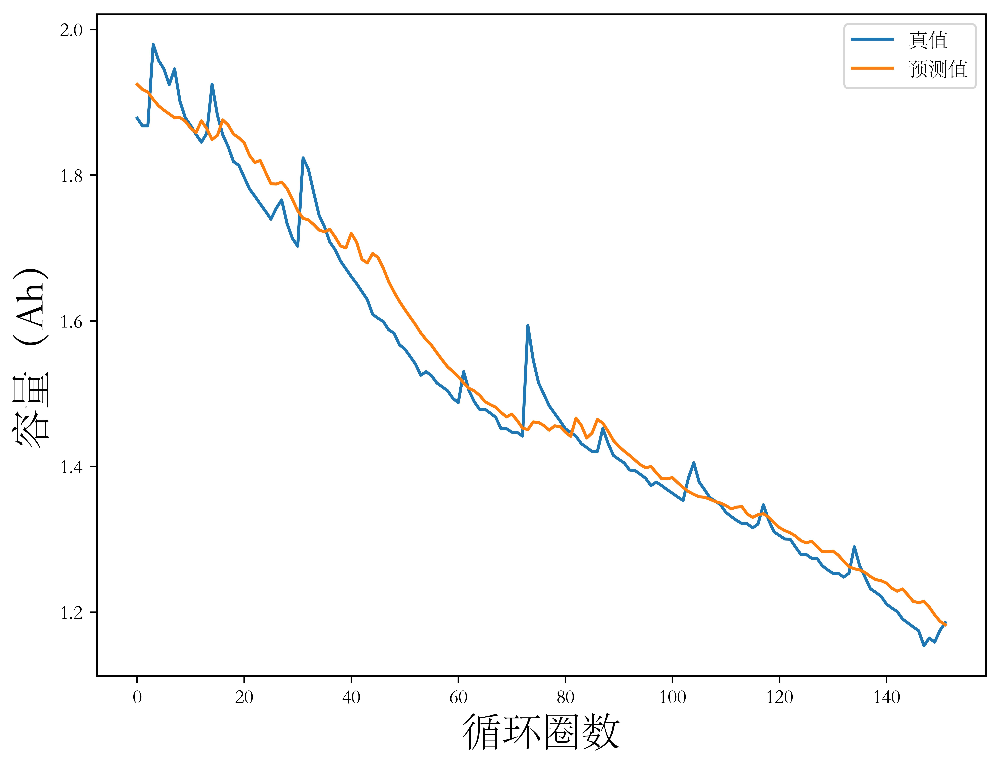
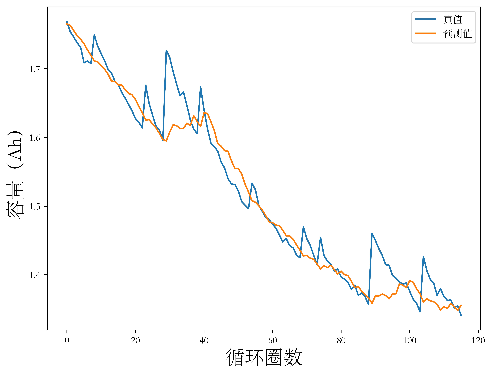
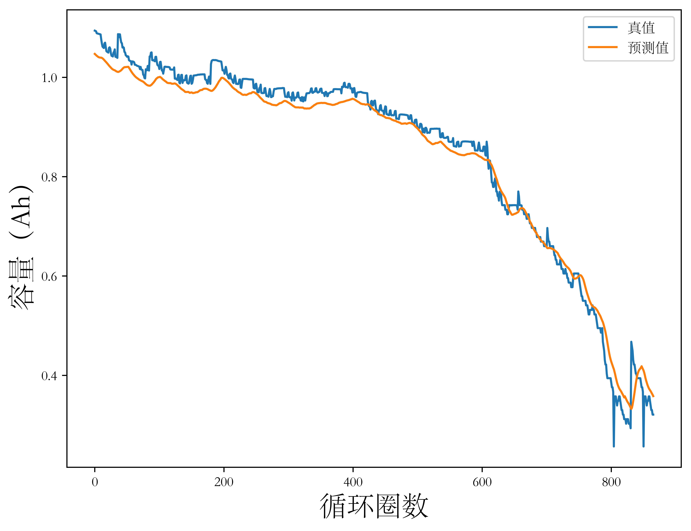
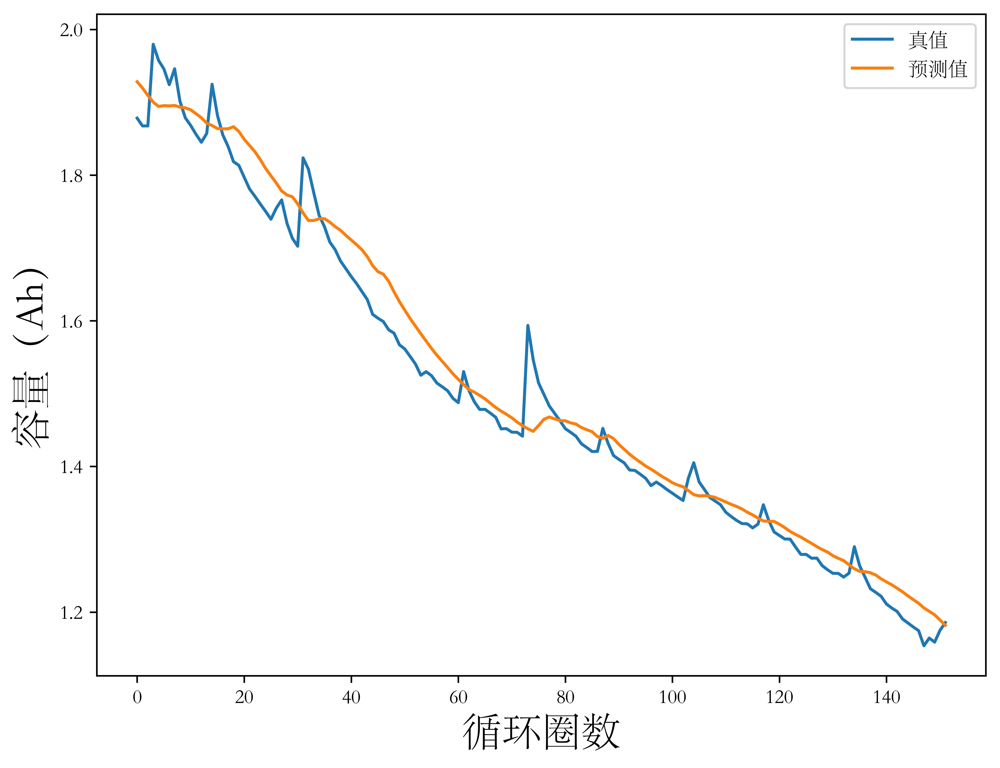

## 3.1 引言

在锂离子电池健康状态估计和剩余寿命预测的数据驱动方法早期研究中，研究人员通常使用单一健康因子表征电池退化状态，数据驱动模型通过健康因子的历史变化数据预测其下一时间步的数值并重新映射回电池健康状态，从而将锂离子电池健康估计问题转换为一般性的时间序列预测问题。深度学习中的一个分支，循环神经网络（Recurrent Neural Network，RNN）尤其是其变体长短期记忆神经网络（Long Short-Term Memory，LSTM），可以用于处理具有时间相关性的数据；通过简单的预处理将序列数据变换为有监督样本的形式，更多深度学习模型如卷积神经网络（Convolutional Neural Network，CNN）等方法也可以用于时间序列分析和预测。同时，早期时间序列回归方法如自回归（Autoregression，AR）算法，部分机器学习方法如支持向量回归（Support Vector Regression，SVR）算法和浅层深度学习方法如多层感知机（Multi-Layer Perceptron，MLP）算法等常被用于锂离子电池健康状态估计问题中。

本章在仔细调研文献和详尽分析锂离子电池公开数据集的基础上，采用NASA数据集（B0005、B0006、B0007和B0018电池）和CALCE数据集（CS2_35、CS2_36、CS2_37和CS2_38电池），使用CNN和LSTM模型开展基于历史容量数据的锂离子电池健康状态估计方法研究并横向对比AR模型、SVR模型和MLP模型，最后通过时间序列预测问题的常用评价指标分析模型性能。

## 3.2 基于长短期记忆神经网络的电池健康状态直接估计方法

### 3.2.1 长短期记忆神经网络原理

以深度学习的视角，锂离子电池SOH估计问题可以看做时间序列预测（Time Series Forecast）问题，更具体地，采用历史容量退化数据进行SOH估计的问题属于单变量有监督时间序列回归（Supervised Univariate Time Series Regression）问题。一类称为RNN的网络具有具有循环连接结构，其诞生正是为了解决时间序列预测问题。LSTM是RNN的一种，以下简要介绍LSTM网络原理与结构，要介绍LSTM网络，首先介绍RNN网络。

（RNN）

RNN的结构以MLP为基础，如【图3-1】为MLP结构图及其展开形式，其中 $X$、$H$ 和 $O$ 分别为输入层向量、隐藏层向量和输出层向量，$U$、$V$ 分别为输入层到隐藏层参数矩阵和隐藏层到输出层参数矩阵。

【图3-1 多层感知机结构示意图】

【图3-2 循环神经网络结构示意图】

（RNN存在的问题、LSTM的原理和LSTM是如何解决RNN的问题的）

MLP模型通过反向传播时的自动微分和随机梯度下降学习参数，RNN的训练过程与此类似，通常称为时间反向传播（）。在此过程中，设输入时间序列的长度为 $n$，在参数学习过程中将计算 $n$ 个时间步的梯度，产生长度为 $O(n)$ 的矩阵乘法链。 

（使用LSTM实现时间序列预测）

### 3.2.2 长短期记忆神经网络模型

介绍具体模型结构和超参数

## 3.3 基于卷积神经网络的电池健康状态直接估计方法

### 3.3.1 卷积神经网络原理

尽管卷积神经网络主要被用于计算机视觉领域处理高维数据，但许多文献表明【文献】，对时间序列输入稍加变换并辅以合理设计的网络结构，CNN同样具备时间序列处理能力。

（卷积）

$$  $$

（池化）

$$  $$

（优化）

$$  $$

### 3.3.2 卷积神经网络模型

（介绍具体模型结构和超参数）

使用CNN处理时间序列，首先引入滑动窗口策略处理时序数据。与上文中介绍的卷积核在输入图/特征图上的滑动过程类似，

## 3.4 实验结果与分析

本节展示CNN模型和LSTM在CALCE数据集和NASA数据集上进行锂离子电池健康状态估计的效果，并对比AR模型、SVR模型和MLP模型。后三者是早期研究中常用的机器学习/浅层神经网络模型。使用最大误差（Max Error，MaxE）、平均绝对误差（Mean Average Error，MAE）和均方根误差（Root Mean Squared Error，RMSE）评估模型性能。

评价指标定义分别为【式】【式】和【式】，式中 $n$ 为循环圈数，$\mathbf{y} = \left \{ y_{1}, y_{2}, \ldots, y_{n} \right \} $ 为容量真值，$\hat {\mathbf{y}} = \left \{ \hat{y_{1}} , \hat{y_{2}} , \ldots, \hat{y_{n}} \right \} $ 为模型预测容量值。

$$MaxE = \max \limits_{1 \leq i \leq n} \lvert y_{i} - \hat{y}_{i} \rvert \tag{3-}$$
$$ E_{mae} = \frac{1}{n} \sum_{i=1}^{n} \lvert y_{i} - \hat{y}_{i} \rvert, i = 1, 2, \ldots, n \tag{3-}$$
$$ E_{rmse} = \sqrt{\frac{1}{n} \sum_{i=1}^{n} (y_{i} - \hat{y}_{i})^{2}} , i = 1, 2, \ldots, n \tag{3-}$$

<figure>
<figcaption>图3- AR模型在CALCE数据集上的预测结果</figcaption>

</figure>

<figure>
<figcaption>图3- AR模型在NASA数据集上的预测结果</figcaption>

</figure>

<figure>
<figcaption>图3- SVR模型在CALCE数据集上的预测结果</figcaption>

</figure>

<figure>
<figcaption>图3- SVR模型在NASA数据集上的预测结果</figcaption>

</figure>

<figure>
<figcaption>图3- MLP模型在CALCE数据集上的预测结果</figcaption>

</figure>

<figure>
<figcaption>图3- MLP模型在NASA数据集上的预测结果</figcaption>

</figure>

<figure>
<figcaption>图3- LSTM模型在CALCE数据集上的预测结果</figcaption>

</figure>

<figure>
<figcaption>图3- LSTM模型在NASA数据集上的预测结果</figcaption>

</figure>

<figure>
<figcaption>图3- CNN模型在CALCE数据集上的预测结果</figcaption>

</figure>

<figure>
<figcaption>图3- CNN模型在NASA数据集上的预测结果</figcaption>

</figure>

## 3.5 本章小结

本章简要介绍了CNN和LSTM两种模型的原理以及将其用于基于电池历史容量退化数据的电池健康状态估计问题时的具体网络结构设计和模型超参数配置。

本章构建了用于实现锂离子电池健康状态估计的五种数据驱动模型，分别是，并在CALCE数据集和NASA数据集上