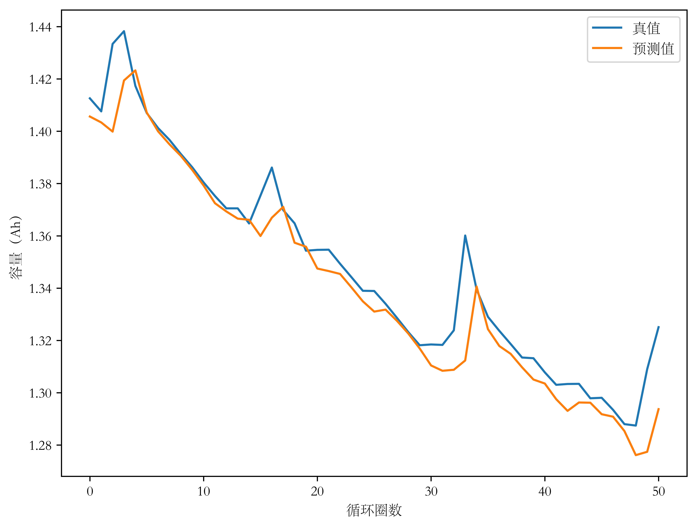
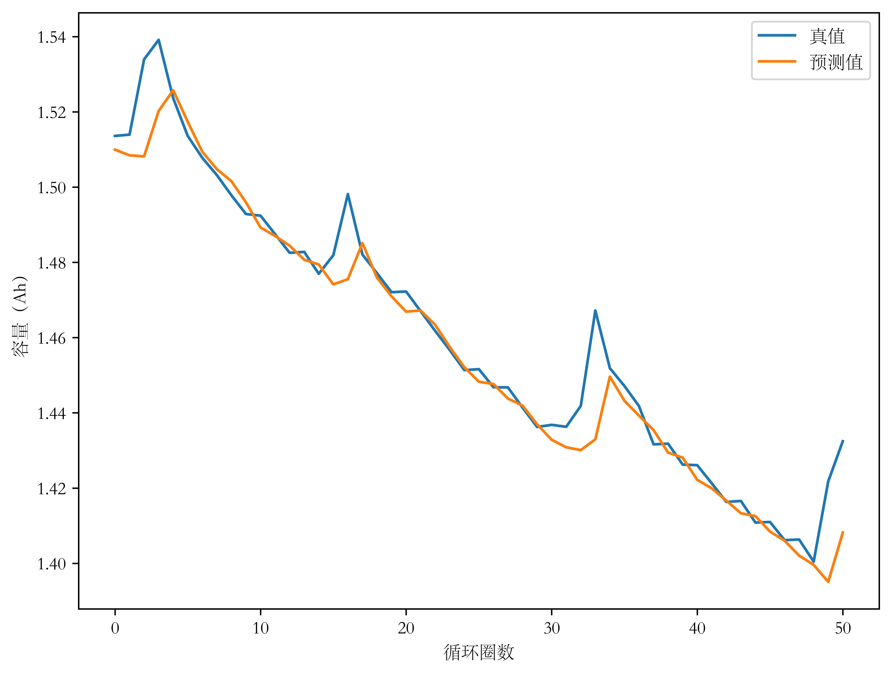
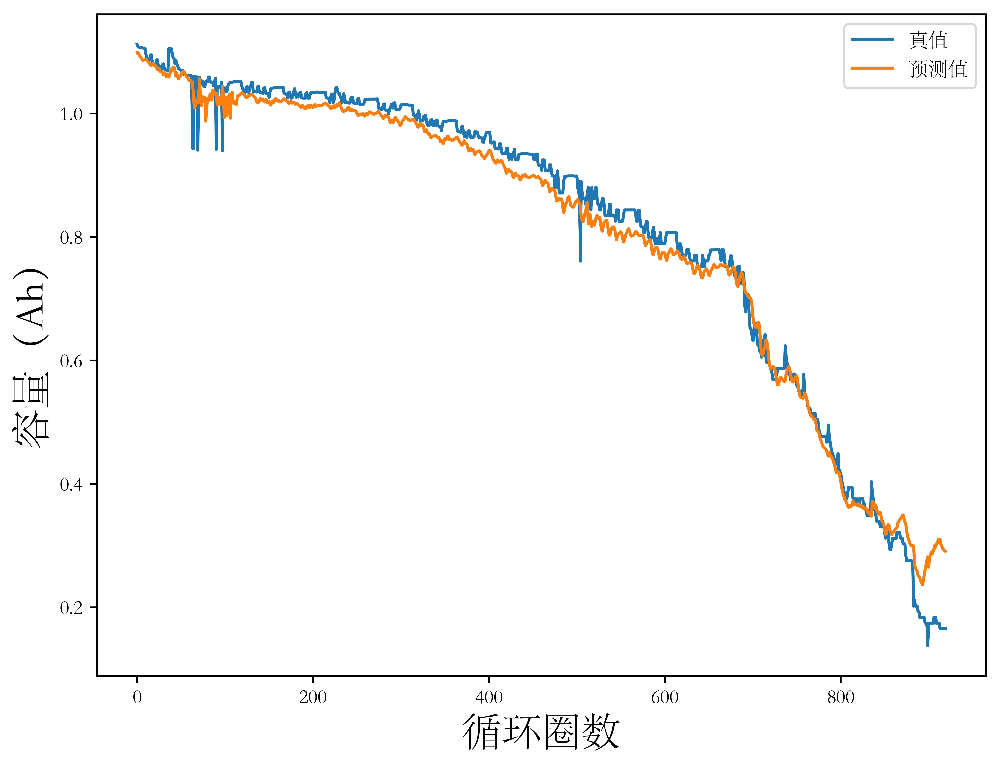
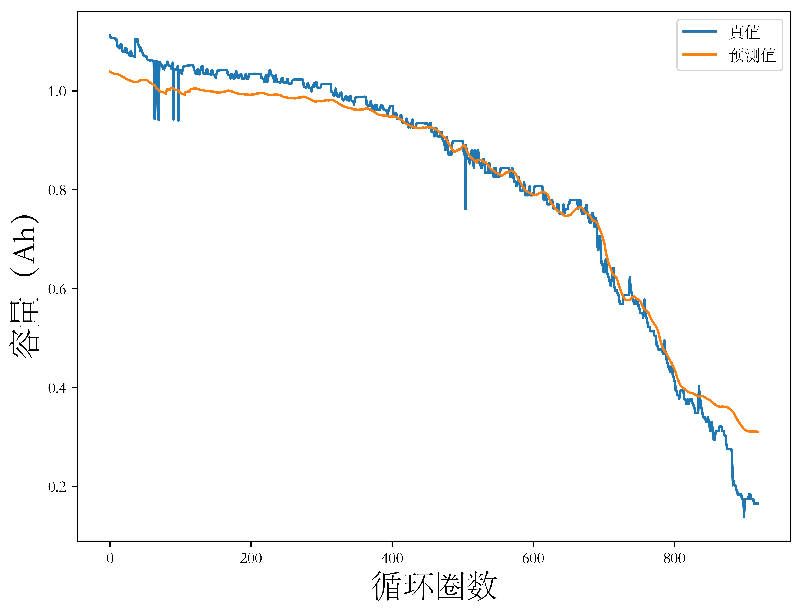
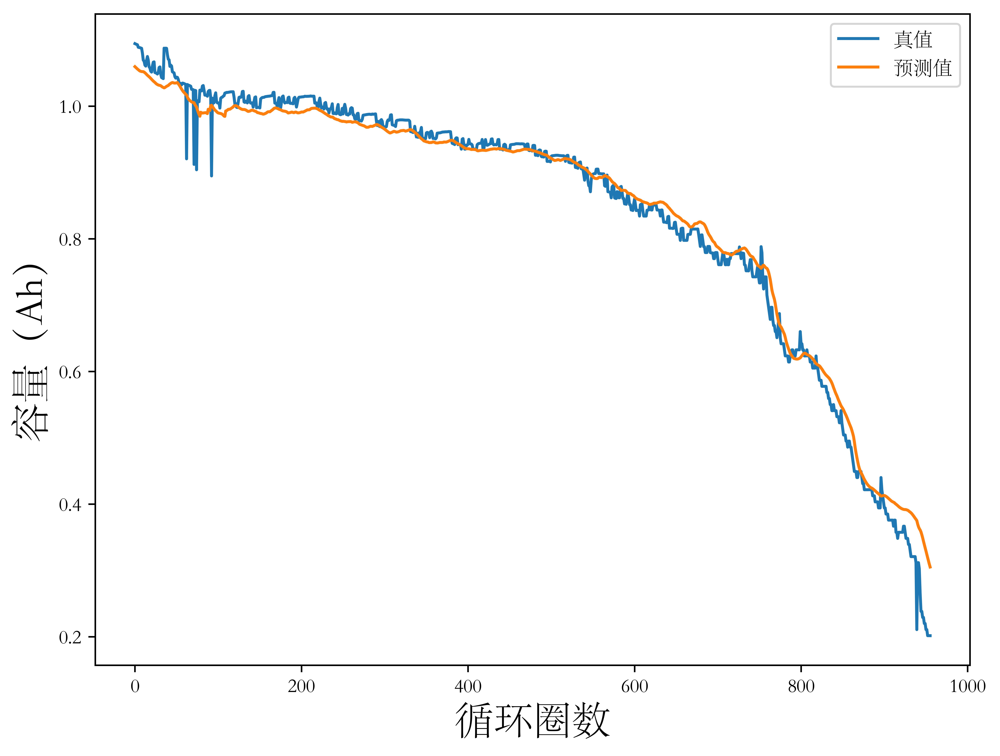
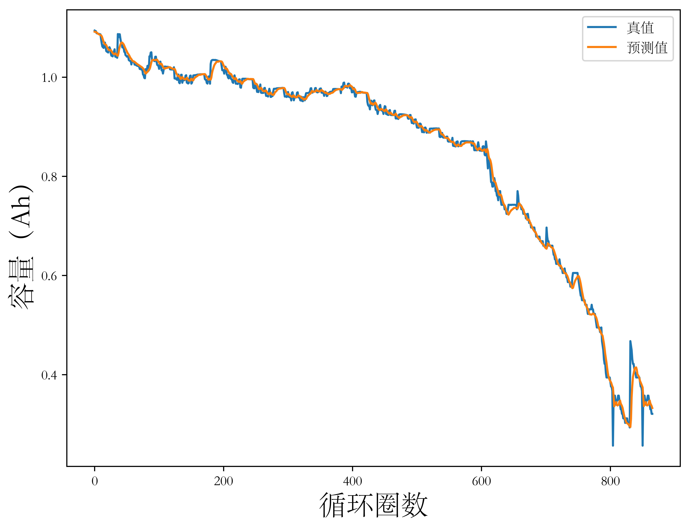
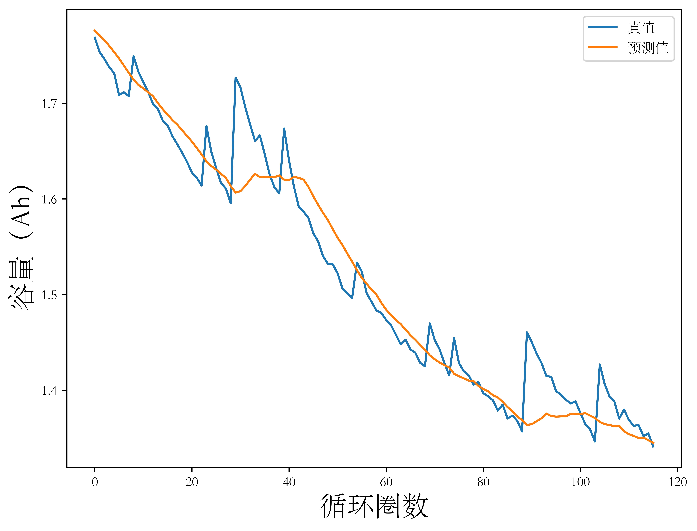

## 3.1 引言

在锂离子电池健康状态估计和剩余寿命预测的数据驱动方法早期研究中，研究人员通常使用单一健康因子表征电池退化状态，数据驱动模型通过健康因子的历史变化数据预测其下一时间步的数值并重新映射回电池健康状态，从而将锂离子电池健康估计问题转换为一般性的时间序列预测问题。深度学习中的一个分支，循环神经网络（Recurrent Neural Network，RNN）尤其是其变体长短期记忆神经网络（Long Short-Term Memory，LSTM），可以用于处理具有时间相关性的数据；通过简单的预处理将序列数据变换为有监督样本的形式，更多深度学习模型如卷积神经网络（Convolutional Neural Network，CNN）等方法也可以用于时间序列分析和预测。同时，早期时间序列回归方法如自回归（Autoregression，AR）算法，部分机器学习方法如支持向量回归（Support Vector Regression，SVR）算法和浅层深度学习方法如多层感知机（Multi-Layer Perceptron，MLP）算法等常被用于锂离子电池健康状态估计问题中。

本章在仔细调研文献和详尽分析锂离子电池公开数据集的基础上，采用NASA PCoE数据集（B0005、B0006、B0007和B0018电池）和CALCE数据集（CS2_35、CS2_36、CS2_37和CS2_38电池），使用CNN和LSTM模型开展基于历史容量数据的锂离子电池健康状态估计方法研究并横向对比AR模型、SVR模型和MLP模型，最后通过时间序列预测问题的常用评价指标分析模型性能。

## 3.2 基于长短期记忆神经网络的电池健康状态直接估计方法

### 3.2.1 长短期记忆神经网络原理

以深度学习的视角，锂离子电池SOH估计问题可以看做时间序列预测（Time Series Forecast）问题，更具体地，采用历史容量退化数据进行SOH估计的问题属于单变量有监督时间序列回归（Supervised Univariate Time Series Regression）问题。总地来说，时间序列回归问题的研究对象是形如 $\mathbf{x}  = \left \{ x_{1}, x_{2}, \ldots ,x_{i}, \ldots, x_{n} \right \} $ 的序列形式数据。其中 $i$ 称为时间步（time step），是时间索引的抽象表达。要预测在某个时间步 $t$ 的观测数据 $x_{t}$，一般先求其分布，如【式3-1】。

$$ x_{t} \sim P \left ( x_{t} | x_{t-1}, x_{t-2}, \ldots,x_{1} \right ) \tag{3-1} $$

为估计【式3-1】中表述的分布的展开，通常使用以下两种策略。第一种策略认为不必采用可能很长的时间序列 $\left \{ x_{t-1}, x_{t-2}, \ldots, x_{1} \right \}$，只采用其中一个长为 $\tau$ 的子列 $\left \{ x_{t-1}, x_{t-2}, \ldots, x_{t-\tau} \right \} \left ( t > \tau \right )$，从而使得每次处理的为一个定长序列，这种策略将子列外的数据全部舍弃，与隐状态无关，称为无隐状态模型.第二种策略采取的方法是对于过去所有观测结果，只保留对其的“总结”$h_{t}$，同时在更新预测值 $\hat{x_{t}}$ 的同时更新 $h_{t}$，如【式3-2】至【式3-4】，在这种策略中，$h_{t}$ 事实上从未被观测到，从而这种模型被称为隐状态模型。

$$ \hat{x_{t}} = P\left ( x_{t} | h_{t-1} \right ) \tag{3-2} $$
$$ h_{t} = g\left ( h_{t-1}, x_{t-1} \right ) \tag{3-3} $$
$$ P\left ( x_{t} | x_{t-1}, x_{t-2}, \ldots, x_1 \right ) \approx P\left ( x_{t} | h_{t-1} \right ) \tag{3-4} $$

一类称为RNN的网络具有具有循环连接结构，是隐状态模型的代表，其诞生正是为了解决时间序列预测问题。LSTM是RNN的一种，以下简要介绍LSTM网络原理与结构，要介绍LSTM网络，首先介绍RNN网络。RNN的结构以MLP为基础。如【图3-1(a)】为MLP结构图及其展开形式，【式3-5】和【式3-6】描述了输入层数据经过隐藏层到达输出层的过程，其中 $X$、$H$ 和 $O$ 分别为输入层向量、隐藏层向量和输出层向量，$U$ 和 $V$ 分别为输入层到隐藏层参数矩阵和隐藏层到输出层参数矩阵，$b_{1}$ 和 $b_{2}$ 分别为隐藏层偏置和输出层偏置，$\sigma$ 为激活函数。

$$ O = \sigma(VH + b_{2}) \tag{3-5} $$
$$ H = UX + b_{1} \tag{3-6} $$

RNN结构处理的问题与MLP等结构正好相反，后者假设输入样本之间独立，而前者要求输入样本之间的相关性。尽管如此，RNN的结构与MLP非常相似，在MLP基础上增加了一个闭合回路，如【图3-1(b)】为RNN结构图及其展开形式，其中 $X$、$H$ 和 $O$ 定义与MLP中相同，$b_{o}$ 和 $b_{f}$ 为隐藏层和输出层偏置，$f$ 和 $g$ 分别为隐藏层和输出层的激活函数，$W$ 为时间点之间的权重矩阵。这一闭合回路的加入，使得RNN在某一时刻生成某一输入的输出时不止仅仅依据该时刻的输入，同时依据上一时刻输入经过隐藏层后的生成结果（即上一时刻隐藏层的输出，这里的讨论以Elman结构为基础，另一种名为Jordan的结构使用上一时刻输出层的结果），如【式3-7】和【式3-8】，这里闭合回路直观上解释为“记忆单元”。

$$ O_{t} = g(VH_{t} + b_{o}) \tag{3-7}$$
$$ H_{t} = f(UX_{t} + WH_{t-1} + b_{f}) \tag{3-8}$$

<figure>
<figcaption>图3-1 多层感知机和循环神经网络结构示意图</figcaption>

</figure>

RNN具有很多变种，区别在于使用了不同的记忆单元，以上讨论的RNN结构是最简单的RNN结构，不妨称其为最简RNN（Simplest RNN，SRNN），其记忆单元对“记忆”信息的写入和读出没有任何控制，导致SRNN模型存在一些问题。具体地，MLP模型通过反向传播时的自动微分和随机梯度下降学习参数，RNN模型的训练过程与此类似，通常称为时间反向传播（Backpropagation Through Time，BPTT），在此过程中，设输入时间序列的长度为 $n$，在参数学习过程中将计算 $n$ 个时间步的梯度，产生长度为 $O(n)$ 的矩阵乘法链。当 $n$ 很大时，这种训练策略将导致数值不稳定，这种数值不稳定性即梯度爆炸或梯度消失。梯度爆炸和梯度消失是限制SRNN模型广泛应用的主要因素。

为克服上述问题，需要对RNN中的记忆单元进行进一步的设计，对记忆信息的写入和读出做更多限制，LSTM结构是一种设计方案。由前所述，RNN网络的结构核心在于记忆单元。如【图3-2】(a)所示为LSTM网络结构中记忆单元的设计示意图，【图3-2】(b)在【图3-2】(a)基础上标明了各部分输入输出信号及各部分计算方式。LSTM在SRNN的基础上向记忆单元加入了三个控制门，分别是输入门（input gate）、输出门（output gate）和遗忘门（forget gate），三个门受输入信号控制，依据输入信号决定开闭和开放程度。SRNN结构中的记忆信息自动地从记忆单元中读出和写入，在LSTM中，输入门控制是否将记忆信息写入记忆单元，输出门控制是否将记忆信息从记忆单元中读出，遗忘门则决定当前存储在记忆单元中地来自过去地记忆信息是否还重要以决定是否将其遗忘，这样的设计使得LSTM网络不知直接利用上一个时间步的记忆信息，具有更强的记忆回溯能力。以下给出上述内容的数学表述，LSTM网络的记忆单元接受一个样本数据，记为 $X_{t}$，$X_{t}$ 经过三次线性变换，生成三个相同维度的向量，分别是 $Z$、$Z_{i}$、$Z_{o}$ 和 $Z_{f}$，分别为输入、输入门控制信号（input gate control signal）、输出门控制信号（output gate control signal）和遗忘门控制信号（forget gate control signal），用于线性变换的矩阵与MLP网络层间的参数矩阵类似，其元素均为可训练参数（trainable parameter），三个矩阵分别记为 $W_{xi}$、$W_{xo}$ 和 $W_{xf}$，该线性变换如【式3-9】至【式3-11】，其中 $\sigma$ 为激活函数。设在第 $t$ 个时间步，更新前记忆单元内记忆信息为 $C_{t-1}$，更新后记忆信息为 $C_{t}$，更新过程如【式3-12】，其中 $f$ 为某种激活函数，后文将对LSTM网络的输入进行修正，修正前暂时将被激活的数据记为 $Z$。最后更新后的记忆信息在遗忘门信号的控制下输出，如【式3-13】。

<figure>
<figcaption>图3-2 长短期记忆神经网络结构示意图</figcaption>

</figure>

$$ I_{t} = \sigma (X_{t} W_{xi}) = \sigma (Z_{i}) \tag{3-9} $$
$$ F_{t} = \sigma (X_{t} W_{xf}) = \sigma (Z_{f}) \tag{3-10} $$
$$ O_{t} = \sigma (X_{t} W_{xo}) = \sigma (Z_{o}) \tag{3-11} $$
$$ C_{t} = F_{t} \odot C_{t-1} + I_{t} \odot f(Z) \tag{3-12} $$
$$ H_{t} = O_{t} \odot tanh(C_{t}) \tag{3-13} $$

进一步地，LSTM网络会将 $C_{t-1}$、$H_{t-1}$ 和 $X_{t}$ 一起作为模型输入，如【图3-2】(c)，对于输入 $H_{t-1}$，与 $X_{t}$ 类似，也要进行线性变换，参与门控信号的生成，这样，【式3-9】至【式3-11】修正为【式3-14】至【式3-16】，其中 $b_{i}$、$b_{f}$ 和 $b_{o}$ 为三个偏置参数。同时由于 $H_{t-1}$ 的加入，$C_{t}$ 的更新也需要修正，引入候选记忆元，其生成过程如【式3-17】，其中 $W_{xc}$ 和 $W_{hc}$ 为权重参数，$b_{c}$ 为偏置参数。记忆单元中记忆信息的更新过程如【式3-18】。隐状态的更新过程保持不变，如【式3-13】。

$$ I_{t} = \sigma (X_{t} W_{xi} + H_{t-1} W_{hi} + b_{i}) \tag{3-14} $$
$$ F_{t} = \sigma (X_{t} W_{xf} + H_{t-1} W_{xf} + b_{f}) \tag{3-15} $$
$$ O_{t} = \sigma (X_{t} W_{xo} + H_{t-1} W_{xo} + b_{o}) \tag{3-16} $$
$$ \tilde{C_{t}} = tanh(X_{t} W_{xc} + H_{t-1} W_{hc} + b_{c}) \tag{3-17} $$
$$ C_{t} = F_{t} \odot C_{t-1} + I_{t} \odot \tilde{C_{t}} \tag{3-18} $$

LSTM可以缓解梯度消失梯度爆炸问题，在长时间序列处理能力上显著优于SRNN。

### 3.2.2 长短期记忆神经网络模型

使用LSTM模型进行时间序列预测，首先对输入的长时间序列进行预处理，通过滑动窗口策略获取相对较短的时间序列，每个LSTM记忆单元（等价于MLP模型隐藏层中的一个神经元）处理一个时间窗口内的数据。设单变量时间序列为 $\mathbf{x} = \left \{ x_{1}, x_{2}, \ldots, x_{n} \right \}  $，引入时间窗口概念，其描述的是 $\mathbf(x)$ 的一个连续子串，设时间窗口长度为 $m$，意味着用前 $m$ 个时间步的数据预测下一个时间步的值。基于此，可将原始长时间序列重构为包含时间窗口内序列/输入向量和目标值/输出的二元组形式的数据集，如【式3-19】。

$$\left \{
    \begin{array}{lr}
    [(x_{1}, x_{2}, \ldots, x_{m}), x_{m+1}]  \\
    [(x_{2}, x_{3}, \ldots, x_{m+1}), x_{m+2}]  \\
    \ldots \\
    [(x_{n-m}, x_{n-m+1}, \ldots, x_{n-1}), x_{n}] (n > m)
    \end{array}
    \right. \tag{3-19} $$

具体地，本章使用CALCE数据集中CS2分组中的四颗单体电池（编号为CS2_35、CS2_36、CS2_37和CS2_38）的容量退化数据和NASA PCoE电池数据集中的四颗单体电池（编号为B0005、B0006、B0007和B0008）的容量退化数据，对于这两个数据集的具体内容已在第二章详细说明，本章从略。LSTM模型实验先对数据集进行滑动窗口处理，设置窗口大小为16，在通过时间窗口方法将原始电池容量退化序列重构为序列-标签形式的样本后，针对每个数据集，将其中一颗电池数据作为测试集（testing dataset），剩下三颗电池的数据按7:3比例划分为训练集（training dataset）和验证集（validation dataset）。

<table>
    <caption>表3-1 基于历史容量的电池SOH估计LSTM模型结构</caption>
    <tr>
        <td>层号</td>
        <td>层类型</td>
        <td>输出形状</td>
        <td>参数量</td>
    </tr>
    <tr>
        <td>1</td>
        <td>LSTM层</td>
        <td>(16, 100)</td>
        <td>41200</td>
    </tr>
    <tr>
        <td>2</td>
        <td>全连接层1</td>
        <td>100</td>
        <td>160100</td>
    </tr>
    <tr>
        <td>3</td>
        <td>全连接层2</td>
        <td>1</td>
        <td>101</td>
    </tr>
</table>

本章使用的LSTM模型包括一个LSTM层和两个全连接层，模型中每一层的类型、输出形状和参数量如【表3-1】，表中对输出形状的描述略去了对批量（batch size）大小的记录。具体地，在LSTM层设置了100个神经元（记忆单元），LSTM层的输出经过有两个全连接层组成的感知机后映射到预测的容量值，每一层在训练时均引入暂退法（dropout），暂退概率（dropout rate）设置为0.2，同时每层设置ReLU函数为激活函数。训练时设置批大小（batch size）为16，训练轮数（epoch）为120，使用Adam优化器，设置学习率为0.0001，设置均方误差（Mean Squared Error，MSE）为损失函数，其定义如【式3-20】，式中 $n$ 为循环圈数，$\mathbf{y} = \left \{ y_{1}, y_{2}, \ldots, y_{n} \right \} $ 为容量真值，$\hat {\mathbf{y}} = \left \{ \hat{y_{1}} , \hat{y_{2}} , \ldots, \hat{y_{n}} \right \} $ 为模型预测容量值。

$$L_{MSE} = \frac{1}{n} \sum_{i=1}^{n} (y_{i} - \hat{y}_{i})^{2} , i = 1, 2, \ldots, n \tag{3-20}$$

使用最大误差（Max Error，MaxE）、平均绝对误差（Mean Absolute Error，MAE）和均方根误差（Root Mean Squared Error，RMSE）评估模型预测性能，其定义分别为【式3-21】、【式3-22】和【式3-23】，式中各种符号记法同【式3-20】。

$$ MaxE = \max \limits_{1 \leq i \leq n} \lvert y_{i} - \hat{y}_{i} \rvert \tag{3-21} $$
$$ E_{mae} = \frac{1}{n} \sum_{i=1}^{n} \lvert y_{i} - \hat{y}_{i} \rvert, i = 1, 2, \ldots, n \tag{3-22} $$
$$ E_{rmse} = \sqrt{\frac{1}{n} \sum_{i=1}^{n} (y_{i} - \hat{y}_{i})^{2}} , i = 1, 2, \ldots, n \tag{3-23} $$

实验结果见本章第四节，其中【表3-6】记录了LSTM模型分别在NASA PCoE数据集和CALCE数据集上的三项评估指标，【图3-10】和【图3-11】为LSTM模型预测的电池容量与电池容量真值的可视化对比。

## 3.3 基于卷积神经网络的电池健康状态直接估计方法

### 3.3.1 卷积神经网络原理

尽管卷积神经网络主要被用于计算机视觉领域处理高维数据，但许多文献表明【文献】，对时间序列输入稍加变换并辅以合理设计的网络结构，CNN同样具备时间序列处理能力，以下简单介绍卷积神经网络的结构。

CNN网络结构中的隐藏层通常包括卷积层（convolution layer）、池化层（pooling layer）和全连接层（fully-connected layer）。如【图】是一个省略了输入层和输出层的CNN网络结构示意图。CNN通过引入卷积操作替换直接进行的线性变换实现相邻层间的映射，使隐藏层中每一层上的神经元变得相对稀疏，具体地，设置一个相对小的卷积核（kernel），通过滑动窗口方法比那里输入层或中间特征图，考虑二维情形，设 $x$ 为输入，$C(a, t)$ 为卷积后得到的特征图在第 $a$ 行、第 $t$ 列 的元素值，卷积核大小为 $(m, n)$，卷积时滑动窗口的移动步幅（stride）为 $(s, d)$，权重参数为 $\omega$，偏置参数为 $b$，激活函数为 $f$，卷积过程的数学表述如【式】。对于激活函数，通常使用线性整流（Rectified Linear Unit，ReLU）函数，其定义如【式3-25】。

<figure>
<figcaption>图3-3 卷积神经网络结构示意图</figcaption>

</figure>

$$ C(a, t) = f \left ( \sum_{i=0}^{m} \sum_{j=0}^{n} x (a \times s+i, t \times d + j) \omega (i, j) + b \right ) \tag{3-24} $$

$$ ReLU(x) = \max(0, x) \tag{3-25} $$

多数CNN具有卷积-池化的交错结构，池化层的作用为降采样，即降低输出到下一层的特征图维度以减小计算开销，提高计算速度。通常采用最大池化或平均池化，这里以最大池化为例，其数学表述如【式】，其他符号约定与【式】中相同。

$$ P(a, t) = \mathop{\max}_{0 \le i \le m-1 \atop 0 \le j \le n-1} \left \{ C(a \times s + i, t \times d + j) \right \} \tag{3-26} $$

全连接层和MLP一致，提供从输入到输出的映射，具体地，输入经过若干卷积-池化交替结构后输出一个包含需要的抽象特征信息的特征图，特征图在送入全连接层之前先被展平为一维向量，此时特征相应区域在展平的向量中的分布并不确定，全连接层能够消除分布差异对最终结果的影响，同时修改输出的形状，如对回归问题，高维特征图通过若干全连接层后逐步降维，最后输出一个标量数值。

综上，CNN使用三个策略减小计算开销提高计算效率，分别是稀疏连接、共享权重和池化结构。区别于MLP模型中相邻层神经元的全连接结构，CNN通过设置较小的滤波器尺寸实现相邻层之间只有部分神经元彼此连接，这样做一方面极大地减少了网络中需要优化的参数数量，另一方面能很大程度上降低模型的过拟合风险。此外，对于CNN中每一层神经元，其与相邻层所有神经元间的连接权重都相同，这样做同样为了减少训练和推理时的计算开销。最后，CNN网络引入池化结构，池化过程本质上是降采样过程，池化结构的引入使得特征图缩小只保留最重要的特征。

### 3.3.2 卷积神经网络模型

使用CNN处理时间序列，同样在时间序列上进行滑动窗口处理。设置窗口大小为16，即使用过去16个循环（时间步）的容量退化数据估计当前循环（时间步）的电池容量。将原始时间序列数据重构为序列-目标值形式的样本后，针对两个数据集，同样采用留一法，取一颗电池数据作为训练集，剩余电池数据按7:3比例划分为训练集和验证集。

<table>
    <caption>表3-2 基于历史容量的电池SOH估计CNN模型结构</caption>
    <tr>
        <td>层号</td>
        <td>层类型</td>
        <td>输出形状</td>
        <td>参数量</td>
    </tr>
    <tr>
        <td>1</td>
        <td>卷积层1</td>
        <td>(64, 15)</td>
        <td>192</td>
    </tr>
    <tr>
        <td>2</td>
        <td>卷积层2</td>
        <td>(32, 14)</td>
        <td>4128</td>
    </tr>
    <tr>
        <td>3</td>
        <td>全连接层1</td>
        <td>50</td>
        <td>22450</td>
    </tr>
    <tr>
        <td>4</td>
        <td>全连接层2</td>
        <td>1</td>
        <td>51</td>
    </tr>
</table>

本章使用的CNN模型包含两个卷积层和两个全连接层，模型中每一层的类型、输出形状和参数数量描述如【表3-2】，同样省略对批大小的记录。具体地，两个卷积层均采用一维卷积，设置第一个卷积核通道数为64，卷积核大小为2，设置第二个卷积核通道数为32，卷积核大小为2，输入经过两个卷积层生成的特征图再通过两个全连接层降维后映射为预测容量值。每层输出结果都经过ReLU函数激活。训练时设置批大小为16，训练轮数为500，使用Adam优化器，使用MSE作为损失函数，设置学习率为0.00001，使用MaxE、MAE和RMSE作为模型性能评价指标。实验结果见本章第四节，其中【表3-7】记录了CNN模型分别在NASA PCoE数据集和CALCE数据集上的三项评估指标，【图3-12】和【图3-13】为CNN模型预测的电池容量与电池容量真值的可视化对比。

## 3.4 实验结果与分析

本节展示CNN模型和LSTM在CALCE数据集和NASA PCoE数据集上进行锂离子电池健康状态估计的效果，并对比AR模型、SVR模型和MLP模型。后三者是早期研究中常用的机器学习/浅层神经网络模型。

AR模型是一种典型的无隐状态线性模型，其假定当前时间步的观测值只取决于前 $p$ 个时间步的观测值且表现出线性关系，如【式】。

$$ \hat{y_{t}} = a_{1}y_{t-1} + a_{2}y_{t-2} + \ldots + a_{p}y_{t-p} + \epsilon
_{t} \tag{3-27} $$

式中 $\epsilon_{t}$ 是随机扰动项（白噪声），$p$ 称为延迟系数。AR模型适用于平稳序列或准平稳序列的回归预测，故首先对原始容量退化数据进行一阶差分使其转换为平稳序列，并依次进行白噪声检验、自相关性分析和偏相关性分析。取延迟系数为16，表示用前16个充放电周期的容量数据估计下一周期的容量。将数据集的后30%设置为测试集，前70%数据按照7：3分割为测试集和验证集。训练好的AR模型在两个测试集上的MaxE、MAE和RMSE指标统计如【表3-3】，预测结果和真值的可视化对比如【图3-4】和【图3-5】。

<figure>
<figcaption>图3-4 AR模型在CALCE数据集上的预测结果</figcaption>

</figure>

<figure>
<figcaption>图3-5 AR模型在NASA PCoE数据集上的预测结果</figcaption>

</figure>

<table>
    <caption>表3-3 AR模型预测性能评估结果</caption>
    <tr>
        <td></td>
        <td>NASA PCoE数据集</td>
        <td></td>
        <td></td>
        <td></td>
        <td>CALCE数据集</td>
        <td></td>
        <td></td>
        <td></td>
    </tr>
    <tr>
        <td></td>
        <td>B0005</td>
        <td>B0006</td>
        <td>B0007</td>
        <td>B0018</td>
        <td>CS2_35</td>
        <td>CS2_36</td>
        <td>CS2_37</td>
        <td>CS2_38</td>
    </tr>
    <tr>
        <td>MaxE</td>
        <td>0.047776</td>
        <td>0.039989</td>
        <td>0.034233</td>
        <td>0.094055</td>
        <td>0.170219</td>
        <td>0.066031</td>
        <td>0.107267</td>
        <td>0.12232</td>
    </tr>
    <tr>
        <td>MAE</td>
        <td>0.007695</td>
        <td>0.007895</td>
        <td>0.005374</td>
        <td>0.011034</td>
        <td>0.00982</td>
        <td>0.010755</td>
        <td>0.009933</td>
        <td>0.011006</td>
    </tr>
    <tr>
        <td>RMSE</td>
        <td>0.012294</td>
        <td>0.01172</td>
        <td>0.009433</td>
        <td>0.019983</td>
        <td>0.019415</td>
        <td>0.014229</td>
        <td>0.014493</td>
        <td>0.016312</td>
    </tr>
</table>

SVR模型来源于支持向量机（support vector machine，SVM）。与SVM类似，SVR引入“间隔带”概念，使得只有在间隔带边界上的支持向量与对应真值的差异才计入损失，实现了稀疏性，提高了计算效率。同样地，SVR引入了核方法，增加了模型对非线性分布数据的预测准确度。实验中取高斯核，设置模型的惩罚系数为10，设置核函数系数为0.5。实验中对数据集先用滑动窗口方法处理，设置滑动窗口长度为16，再采用留一法，即对数据集中的四颗电池数据，使用其中一颗电池数据作为测试集数据，另外三颗按7:3比例划分为测试集和验证集。后续MLP模型、LSTM模型和CNN模型实验中数据集均采用这种处理方式，不再重复说明。训练好的SVR模型在两个测试集上的各项指标如【表3-4】，预测结果和真值的可视化对比如【图3-6】和【图3-7】。

<figure>
<figcaption>图3-6 SVR模型在CALCE数据集上的预测结果</figcaption>

</figure>

<figure>
<figcaption>图3-7 SVR模型在NASA PCoE数据集上的预测结果</figcaption>

</figure>

<table>
    <caption>表3-4 SVR模型预测性能评估结果</caption>
    <tr>
        <td></td>
        <td>NASA PCoE数据集</td>
        <td></td>
        <td></td>
        <td></td>
        <td>CALCE数据集</td>
        <td></td>
        <td></td>
        <td></td>
    </tr>
    <tr>
        <td></td>
        <td>B0005</td>
        <td>B0006</td>
        <td>B0007</td>
        <td>B0018</td>
        <td>CS2_35</td>
        <td>CS2_36</td>
        <td>CS2_37</td>
        <td>CS2_38</td>
    </tr>
    <tr>
        <td>MaxE</td>
        <td>0.055918</td>
        <td>0.165065</td>
        <td>0.077455</td>
        <td>0.092054</td>
        <td>0.173213</td>
        <td>0.144716</td>
        <td>0.109326</td>
        <td>0.138677</td>
    </tr>
    <tr>
        <td>MAE</td>
        <td>0.029598</td>
        <td>0.048098</td>
        <td>0.024318</td>
        <td>0.03214</td>
        <td>0.027749</td>
        <td>0.024278</td>
        <td>0.021895</td>
        <td>0.020879</td>
    </tr>
    <tr>
        <td>RMSE</td>
        <td>0.032088</td>
        <td>0.05428</td>
        <td>0.026477</td>
        <td>0.035924</td>
        <td>0.0316</td>
        <td>0.032347</td>
        <td>0.025152</td>
        <td>0.024601</td>
    </tr>
</table>

MLP模型在本章第二节介绍RNN网络结构时已简单说明并给出结构示意图。MLP结构包括输入层、隐藏层和输出层，其中层与层间先进行线性变换再通过激活函数得到该层的输出。MLP实验中设置输入层神经元数量为16，与滑动窗口长度对应，输出层神经元数量为1，即为模型预测的电池健康状态数值，设置一个隐藏层，其神经元数量为8，采用ReLU函数作为激活函数，其定义亦在本章第二节给出。数据集分割方式与SVR实验相同，此处从略。训练时，设置一个批量的大小为16，训练轮数为20，使用MAE作为损失函数，使用Adam优化器，设置学习率为0.01。训练好的MLP模型在两个测试集上的各项指标如【表3-5】，预测结果和真值的可视化对比如【图3-8】和【图3-9】。

<figure>
<figcaption>图3-8 MLP模型在CALCE数据集上的预测结果</figcaption>

</figure>

<figure>
<figcaption>图3-9 MLP模型在NASA PCoE数据集上的预测结果</figcaption>

</figure>

<table>
    <caption>表3-5 MLP模型预测性能评估结果</caption>
    <tr>
        <td></td>
        <td>NASA PCoE数据集</td>
        <td></td>
        <td></td>
        <td></td>
        <td>CALCE数据集</td>
        <td></td>
        <td></td>
        <td></td>
    </tr>
    <tr>
        <td></td>
        <td>B0005</td>
        <td>B0006</td>
        <td>B0007</td>
        <td>B0018</td>
        <td>CS2_35</td>
        <td>CS2_36</td>
        <td>CS2_37</td>
        <td>CS2_38</td>
    </tr>
    <tr>
        <td>MaxE</td>
        <td>0.072808</td>
        <td>0.157375</td>
        <td>0.098959</td>
        <td>0.116287</td>
        <td>0.175253</td>
        <td>0.13257</td>
        <td>0.11689</td>
        <td>0.166985</td>
    </tr>
    <tr>
        <td>MAE</td>
        <td>0.018195</td>
        <td>0.022015</td>
        <td>0.012891</td>
        <td>0.023748</td>
        <td>0.008996</td>
        <td>0.010223</td>
        <td>0.008369</td>
        <td>0.009344</td>
    </tr>
    <tr>
        <td>RMSE</td>
        <td>0.02181</td>
        <td>0.032336</td>
        <td>0.019159</td>
        <td>0.03173</td>
        <td>0.014933</td>
        <td>0.015308</td>
        <td>0.012758</td>
        <td>0.014805</td>
    </tr>
</table>

LSTM模型原理和结构及本实验中使用的LSTM模型设计已在本章第二节说明，此处从略。实验结果如【表3-6】、【图3-10】和【图3-11】。

<figure>
<figcaption>图3-10 LSTM模型在CALCE数据集上的预测结果</figcaption>

</figure>

<figure>
<figcaption>图3-11 LSTM模型在NASA PCoE数据集上的预测结果</figcaption>

</figure>

<table>
    <caption>表3-6 LSTM模型预测性能评估结果</caption>
    <tr>
        <td></td>
        <td>NASA PCoE数据集</td>
        <td></td>
        <td></td>
        <td></td>
        <td>CALCE数据集</td>
        <td></td>
        <td></td>
        <td></td>
    </tr>
    <tr>
        <td></td>
        <td>B0005</td>
        <td>B0006</td>
        <td>B0007</td>
        <td>B0018</td>
        <td>CS2_35</td>
        <td>CS2_36</td>
        <td>CS2_37</td>
        <td>CS2_38</td>
    </tr>
    <tr>
        <td>MaxE</td>
        <td>0.15179</td>
        <td>0.17674</td>
        <td>0.133804</td>
        <td>0.171014</td>
        <td>0.160861</td>
        <td>0.179085</td>
        <td>0.138158</td>
        <td>0.130194</td>
    </tr>
    <tr>
        <td>MAE</td>
        <td>0.041876</td>
        <td>0.047997</td>
        <td>0.042824</td>
        <td>0.03454</td>
        <td>0.028106</td>
        <td>0.041033</td>
        <td>0.028373</td>
        <td>0.017837</td>
    </tr>
    <tr>
        <td>RMSE</td>
        <td>0.057897</td>
        <td>0.068772</td>
        <td>0.054669</td>
        <td>0.047809</td>
        <td>0.033164</td>
        <td>0.05132</td>
        <td>0.033656</td>
        <td>0.022234</td>
    </tr>
</table>

CNN模型原理和结构及本实验中使用的CNN模型设计已在本章第二节说明，此处从略。实验结果如【表3-7】、【图3-12】和【图3-13】。

<figure>
<figcaption>图3-12 CNN模型在CALCE数据集上的预测结果</figcaption>

</figure>

<figure>
<figcaption>图3-13 CNN模型在NASA PCoE数据集上的预测结果</figcaption>

</figure>

<table>
    <caption>表3-7 CNN模型预测性能评估结果</caption>
    <tr>
        <td></td>
        <td>NASA PCoE数据集</td>
        <td></td>
        <td></td>
        <td></td>
        <td>CALCE数据集</td>
        <td></td>
        <td></td>
        <td></td>
    </tr>
    <tr>
        <td></td>
        <td>B0005</td>
        <td>B0006</td>
        <td>B0007</td>
        <td>B0018</td>
        <td>CS2_35</td>
        <td>CS2_36</td>
        <td>CS2_37</td>
        <td>CS2_38</td>
    </tr>
    <tr>
        <td>MaxE</td>
        <td>0.080894</td>
        <td>0.144347</td>
        <td>0.106636</td>
        <td>0.120415</td>
        <td>0.171052</td>
        <td>0.125632</td>
        <td>0.115335</td>
        <td>0.156275</td>
    </tr>
    <tr>
        <td>MAE</td>
        <td>0.015108</td>
        <td>0.028995</td>
        <td>0.01365</td>
        <td>0.023968</td>
        <td>0.006961</td>
        <td>0.008843</td>
        <td>0.009104</td>
        <td>0.007127</td>
    </tr>
    <tr>
        <td>RMSE</td>
        <td>0.021419</td>
        <td>0.035597</td>
        <td>0.020144</td>
        <td>0.0329</td>
        <td>0.012499</td>
        <td>0.014274</td>
        <td>0.01343</td>
        <td>0.01289</td>
    </tr>
</table>

将AR模型、SVR模型、MLP模型、LSTM模型和CNN模型在两个数据集上的预测性能取均值汇总如【表3-8】。在NASA PCoE数据集上，AR模型取得了最好的平均性能，其平均MaxE为0.054，平均MAE为0.008，平均RMSE为0.013，MLP模型次之，其平均MaxE、平均MAE和平均RMSE分别为0.111、0.019和0.026。在CALCE数据集上，CNN模型取得了最好的平均性能，其平均MaxE、平均MAE和平均RMSE分别为0.142、0.008和0.013，MLP模型次之，其平均MaxE、平均MAE和平均RMSE分别为0.147、0.009和0.014。需要说明的是，本章设计的实验中，AR模型由于其自身限制，训练时使用的数据划分策略与其他模型不同，且这种数据准备方式限制较多，并不具有实际意义，其性能评估结果仅做参考，从而在NASA PCoE数据集上平均性能最优的模型是MLP模型，其次为CNN模型，CNN模型的平均MaxE、平均MAE和平均RMSE分别为0.113、0.020和0.027。NASA PCoE数据集诞生较早，其中使用的电池的循环寿命相对较短，在这种情况下非隐状态模型如MLP模型和CNN模型往往预测性能较好，隐状态模型即LSTM反而因为参数较多，训练过程复杂并不具备很高的可用性。无论哪一种模型，在CALCE数据集上的预测性能均由于在NASA PCoE数据集上的预测性能，这是由于前者循环寿命更长，能够提供更多的历史信息。

<table>
    <caption>表3-8 五种模型预测性能评估结果汇总</caption>
    <tr>
        <td>NASA PCoE数据集</td>
        <td></td>
        <td></td>
        <td></td>
        <td></td>
        <td>CALCE数据集</td>
        <td></td>
        <td></td>
        <td></td>
        <td></td>
    </tr>
    <tr>
        <td></td>
        <td>AR</td>
        <td>SVR</td>
        <td>MLP</td>
        <td>LSTM</td>
        <td>CNN</td>
        <td>AR</td>
        <td>SVR</td>
        <td>MLP</td>
        <td>LSTM</td>
        <td>CNN</td>
    </tr>
    <tr>
        <td>Avg_MaxE</td>
        <td>0.05401325</td>
        <td>0.097623</td>
        <td>0.11135725</td>
        <td>0.158337</td>
        <td>0.113073</td>
        <td>0.11645925</td>
        <td>0.141483</td>
        <td>0.1479245</td>
        <td>0.1520745</td>
        <td>0.1420735</td>
    </tr>
    <tr>
        <td>Avg_MAE</td>
        <td>0.0079995</td>
        <td>0.0335385</td>
        <td>0.01921225</td>
        <td>0.04180925</td>
        <td>0.02043025</td>
        <td>0.0103785</td>
        <td>0.02370025</td>
        <td>0.009233</td>
        <td>0.02883725</td>
        <td>0.00800875</td>
    </tr>
    <tr>
        <td>Avg_RMSE</td>
        <td>0.0133575</td>
        <td>0.03719225</td>
        <td>0.02625875</td>
        <td>0.05728675</td>
        <td>0.027515</td>
        <td>0.01611225</td>
        <td>0.028425</td>
        <td>0.014451</td>
        <td>0.0350935</td>
        <td>0.01327325</td>
    </tr>
</table>

## 3.5 本章小结

本章简要介绍了CNN和LSTM两种模型的原理，阐述了将这两种模型用于基于电池历史容量退化数据的电池健康状态估计问题时的数据预处理过程、网络结构设计和模型超参数配置。除此之外，本课题实现了另外三种可用于电池健康状态估计的模型，分别是无隐状态的自回归模型、支持向量回归模型和多层感知机模型，在CALCE数据集和NASA PCoE数据集上实验并依据最大误差、平均绝对误差和均方根误差归纳其预测性能。通过实验可以总结下述结论：1）更长的电池循环寿命往往能提供更多容量退化信息，有利于提高模型的预测精度；2）对于历史容量数据作为输入的情形，非隐状态模型相比于隐状态模型能取得更好的预测效果。