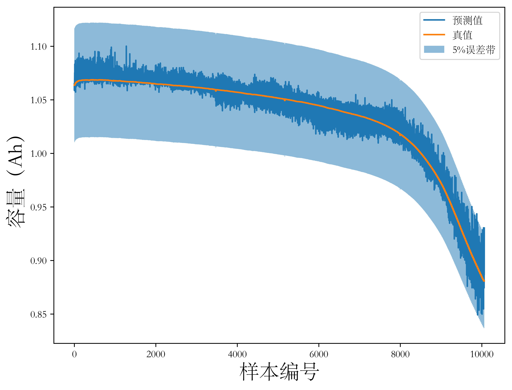
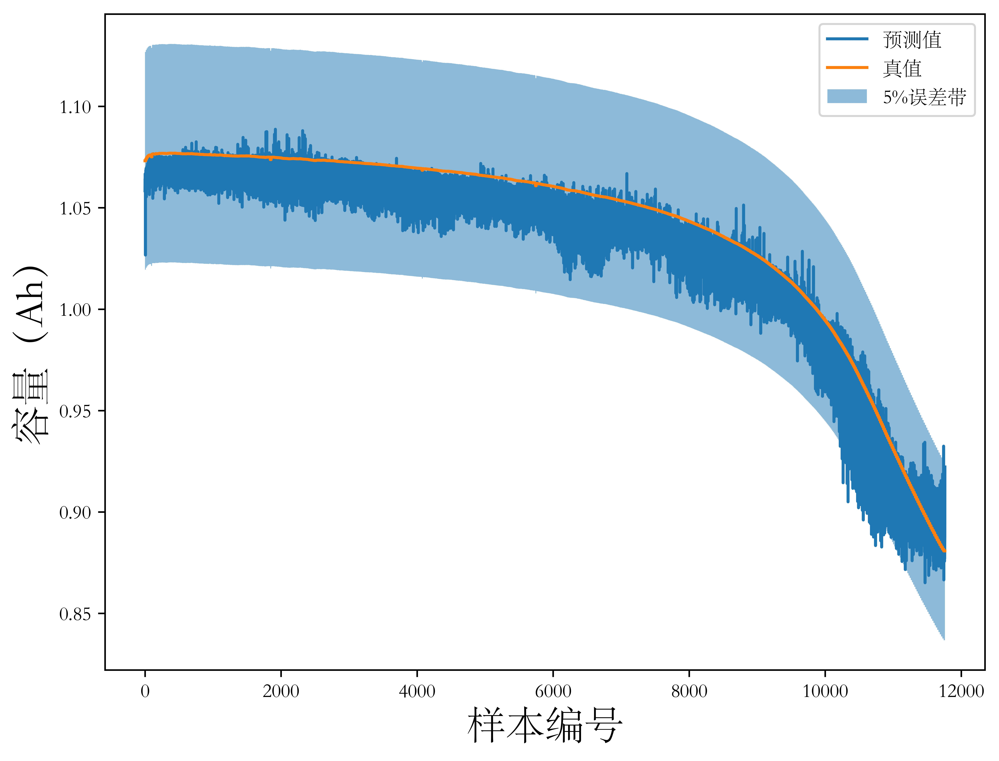
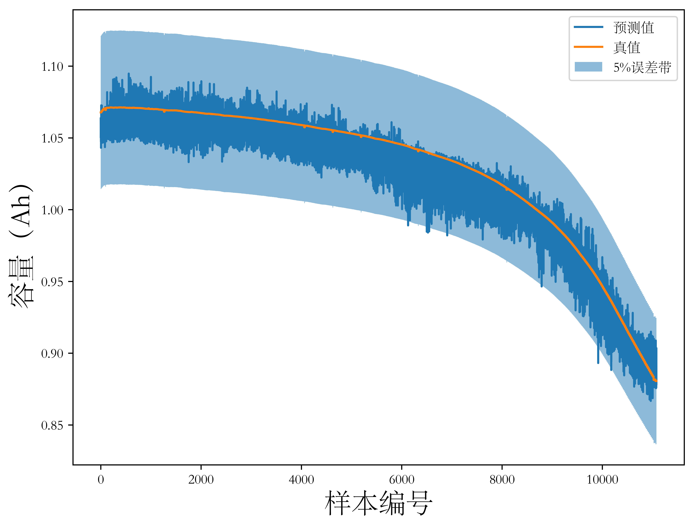
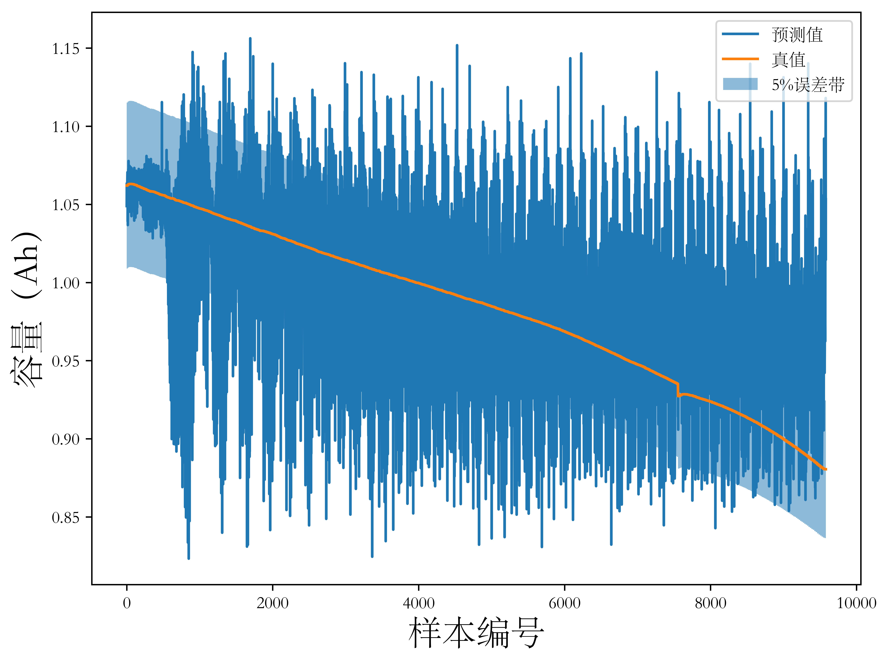
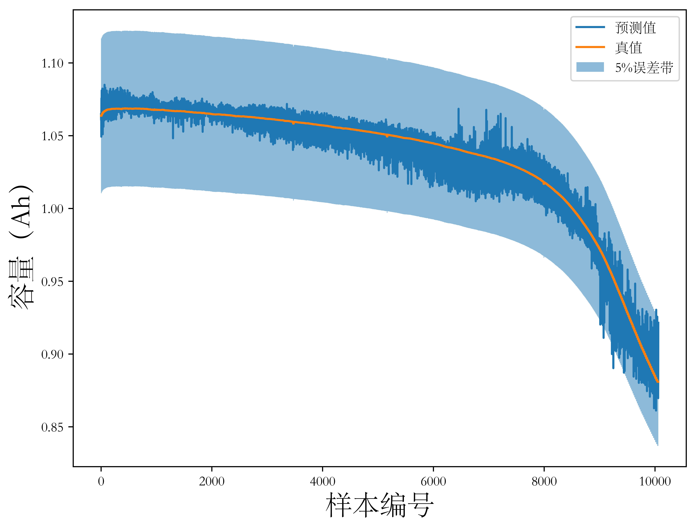
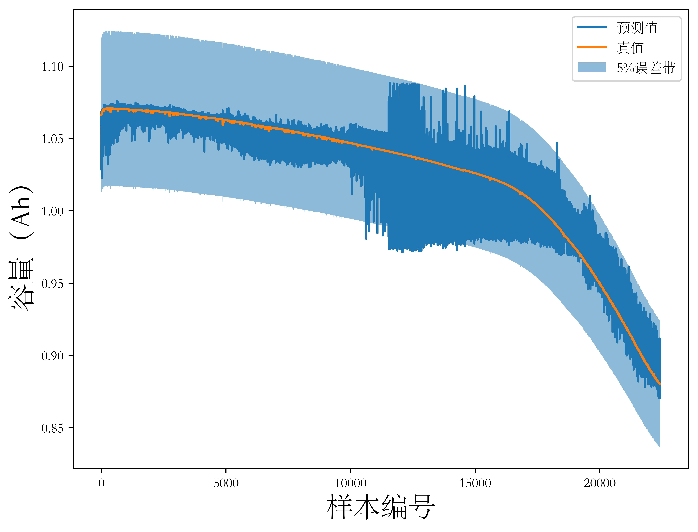
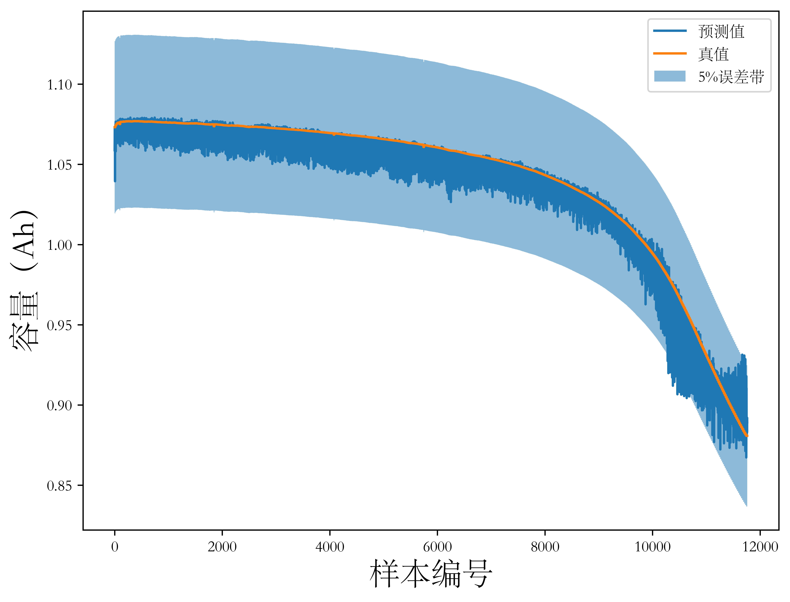
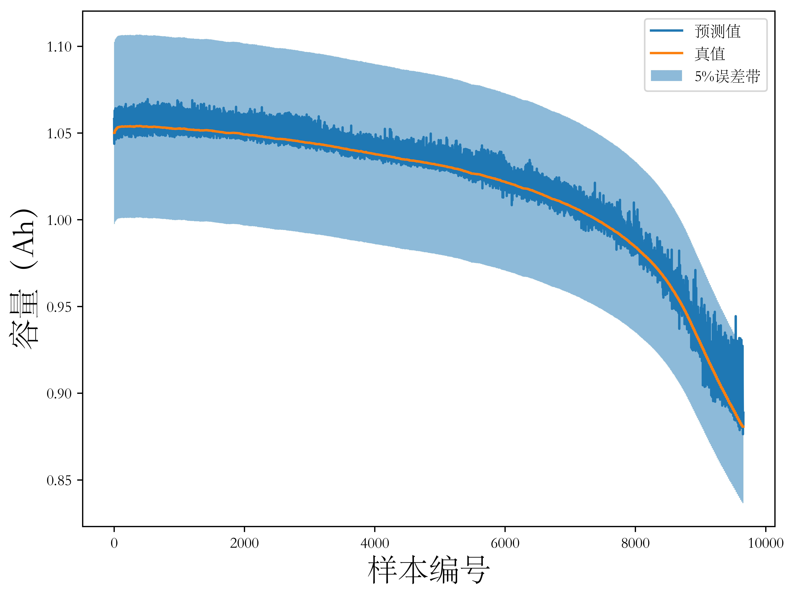
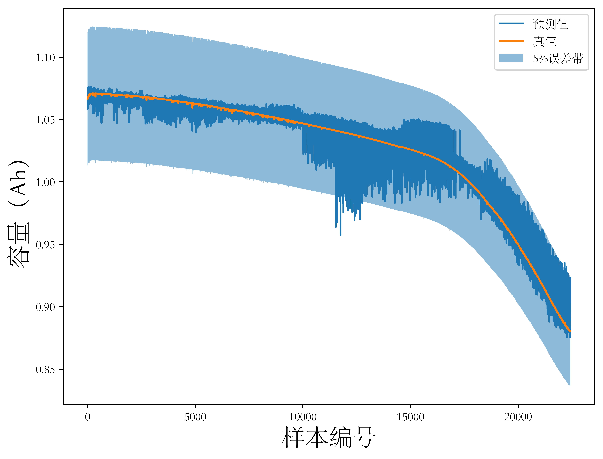
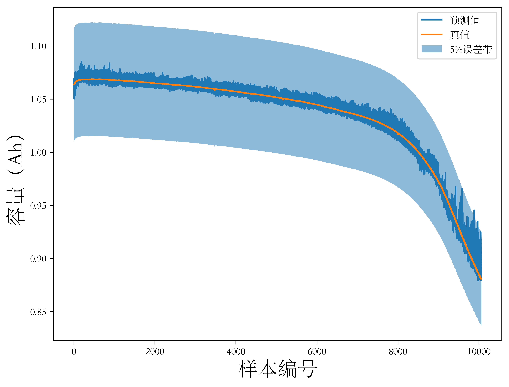

## 4.1 引言

上一章分析了不同模型直接基于电池容量历史数据实现电池健康状态估计的原理和算法性能。这种方法面临以下问题：其一是很难实现锂离子电池的放电容量的非侵入式测量，应用中往往手动构建与电池容量等价的健康因子，通过健康因子映射电池健康状态，但这种健康因子构建与机理模型类似，需要相对详尽的机理模型参与，同时泛化能力有限；其二，使用历史循环数据，无论是直接使用容量数据还是通过健康因子进行时间序列回归，都需要若干周期完整充放电循环数据作为输入。

以上两个问题很大程度地限制了直接使用历史容量退化数据进行电池健康状态估计方法的应用。基于此，本章提出了一种基于锂离子电池充放电过程中直接测量量的电池健康状态估计方法。本章沿用前一章在时间序列上使用的滑动窗口策略并介绍了一种时间序列-图像变换方法进行数据处理，分别使用充放电时测量的电流、电压、温度和电池电荷量作为输入循环测量量作为输入，并基于经典的LeNet-5结构设计了用于电池健康状态估计的CNN模型，在TRI数据上实验并分析其预测性能。

## 4.2 数据预处理：时间序列-图像变换

早期电池健康估计方法研究从电池充电电压数据中手动提取信息构造健康因子（health indicator）以克服电池历史容量数据难以获取的问题。这一方法随着深度学习领域研究的深入演变为将电池充电电压原始数据直接送入注入CNN模型一类结构中以自动实施特征提取。称一个特征（如电压）为一个通道，【文献】比较了使用多通道数据（如电压、电流和表面温度）作为输入和仅使用单通道数据（电压）输入时模型的预测性能，证明前者对提高预测准确度有增益。

构造包含多通道数据的样本，自然地，仿照本文第三章中历史容量数据样本的构造方式，对原始时间序列采用滑动窗口策略可以得到一系列样本。设时间窗口长度为 $w$，则构造的单通道样本形状为 $<(1, w), 1>$，其中 $(1, w)$ 为输入序列，也即特征，表示为行向量，$1$为标签，是一个标量。

## 4.3 基于卷积神经网络的锂离子电池健康状态间接估计方法

（网络结构）

（超参数说明）

## 4.4 实验结果与分析

（数据分组）

如【图4-1】为使用充放电过程中的电压、电流和温度数据，同时不进行时间序列-时间变换直接作为输入时模型在TRI数据集的四个分组上的实验结果。

<figure>
<figcaption>V、I、T输入，不进行时间序列-图形变换（第一组）</figcaption>

</figure>

<figure>
<figcaption>V、I、T输入，不进行时间序列-图形变换（第二组）</figcaption>

</figure>

<figure>
<figcaption>V、I、T输入，不进行时间序列-图形变换（第三组）</figcaption>

</figure>

<figure>
<figcaption>V、I、T输入，不进行时间序列-图形变换（第四组）</figcaption>

</figure>

如【图4-2】为使用充放电过程中电压、电流和温度数据先进行时间序列-图像变换再输入模型时模型在数据集四个分组上的实验结果。

<figure>
<figcaption>V、I、T输入，进行时间序列-图形变换（第一组）</figcaption>

</figure>

<figure>
<figcaption>V、I、T输入，进行时间序列-图形变换（第二组）</figcaption>

</figure>

<figure>
<figcaption>V、I、T输入，进行时间序列-图形变换（第三组）</figcaption>

</figure>

<figure>
<figcaption>V、I、T输入，进行时间序列-图形变换（第四组）</figcaption>

</figure>

如【图】为

<figure>
<figcaption>V、I、q输入，不进行时间序列-图形变换（第一组）</figcaption>

</figure>

<figure>
<figcaption>V、I、q输入，不进行时间序列-图形变换（第二组）</figcaption>

</figure>

<figure>
<figcaption>V、I、q输入，不进行时间序列-图形变换（第三组）</figcaption>

</figure>

<figure>
<figcaption>V、I、q输入，不进行时间序列-图形变换（第四组）</figcaption>

</figure>

如【图】为

<figure>
<figcaption>V、I、q输入，进行时间序列-图形变换（第一组）</figcaption>

</figure>

<figure>
<figcaption>V、I、q输入，进行时间序列-图形变换（第二组）</figcaption>

</figure>

<figure>
<figcaption>V、I、q输入，进行时间序列-图形变换（第三组）</figcaption>

</figure>

<figure>
<figcaption>V、I、q输入，进行时间序列-图形变换（第四组）</figcaption>

</figure>

## 4.5 本章小结

本章沿用前文使用的滑动窗口方法进行锂离子电池充放电循环数据分段，直接将将分段数据作为样本，一方面实现了数据增广，满足了深度神经网络的训练过程对数据量的需求，另一方面为CNN模型对输入数据的鲁棒性奠定基础，很大程度上使得网络对任意起点（相对充放电周期而言）的输入数据都能得到准确的估计结果。其次，本章介绍了一种时间序列到图像变换方法，满足了直接基于原始循环过程测量量（电流、电压、电池表面温度和电荷量）进行状态估计的要求，同时使得CNN模型能更好地利用输入数据的时空相关性、提高模型预测精度并简化模型的设计难度和计算复杂度。最后，本章基于上述预处理步骤，提出一种结构简单、性能优异的CNN网络结构，建立了更符合应用需求的锂离子电池健康状态估计模型，消除了对锂离子电池工作机理相关的先验领域知识的需要，同时，模型可以自主学习其参数和权重（离线模型更新），并基于训练结果实现快速的精准的在线健康状态估计（在线模型应用）。

本文进行了四组实验，分别是：1）以电压、电流和温度数据为输入，不进行时间序列-图像变换的实验，2）以电压、电流和温度数据为输入，进行时间序列-图像变换的实验，3）以电压、电流和电池电荷量为输入，不进行时间序列-图像变换的实验和4）以电压、电流和电池电荷量为输入，进行时间序列-图像变换的实验。实验在TRI数据集上进行，统计并对比模型预测精度和模型参数量。实验结果表明，使用电池电荷量替换电池温度作为模型输入可以显著提高模型预测精度（结合具体实验结果说明），而使用时间序列-图像变换能一定程度上提高模型性能（结合具体实验结果说明），同时显著降低模型参数量（结合具体实验结果说明），为模型在实际车机系统上的部署奠定了基础。