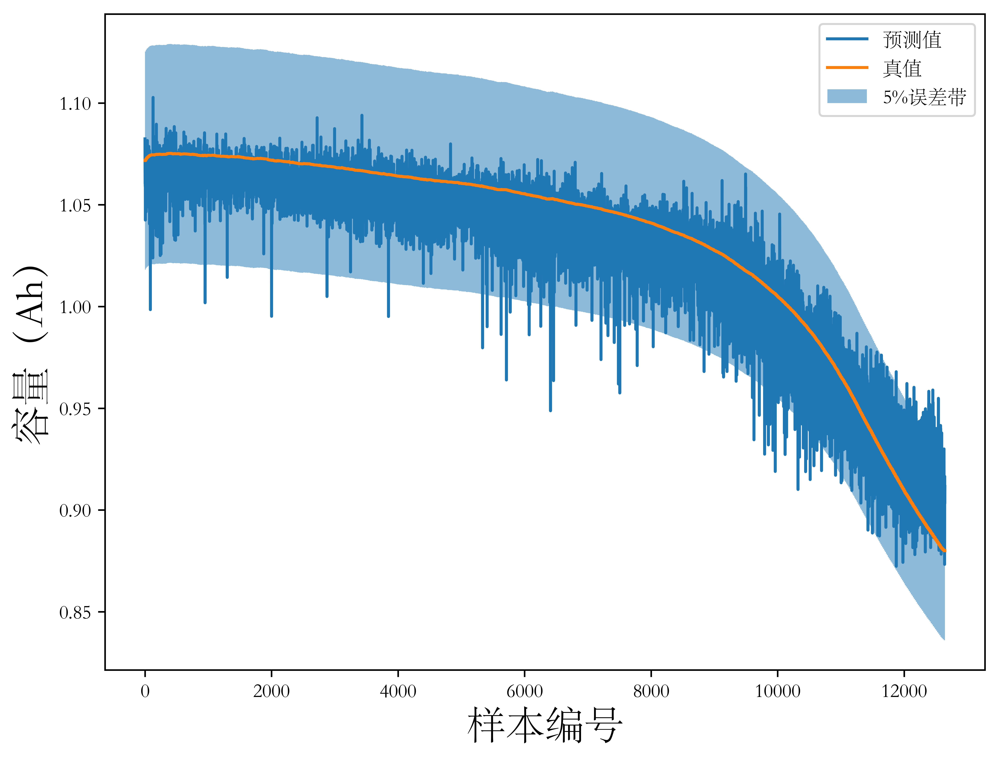
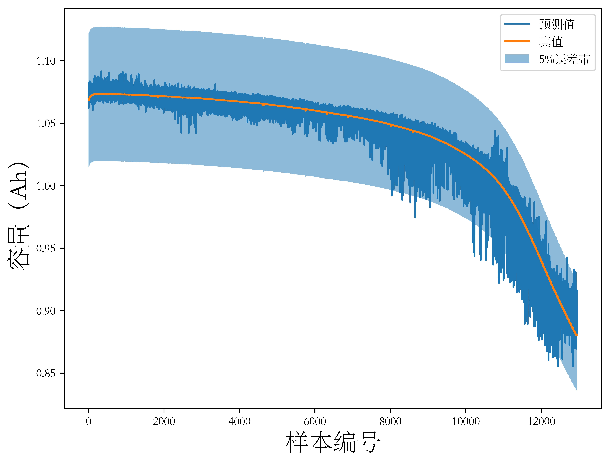
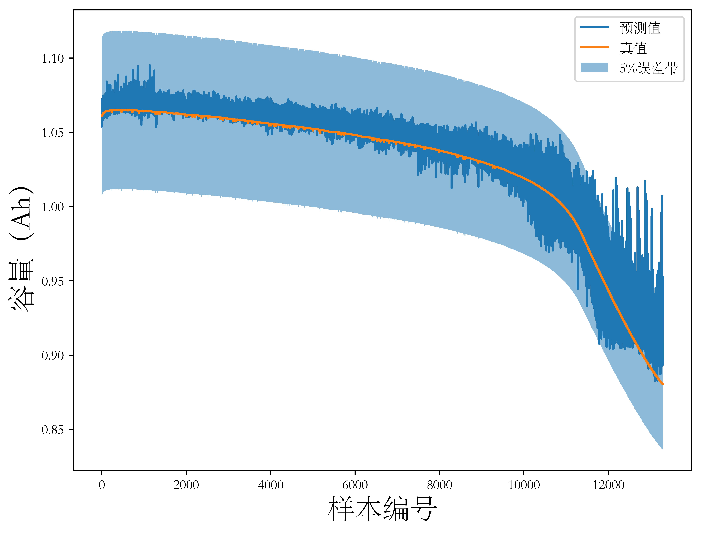
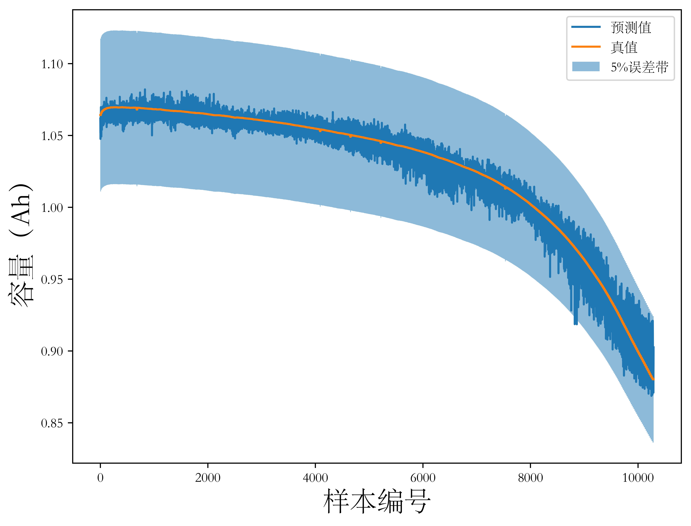
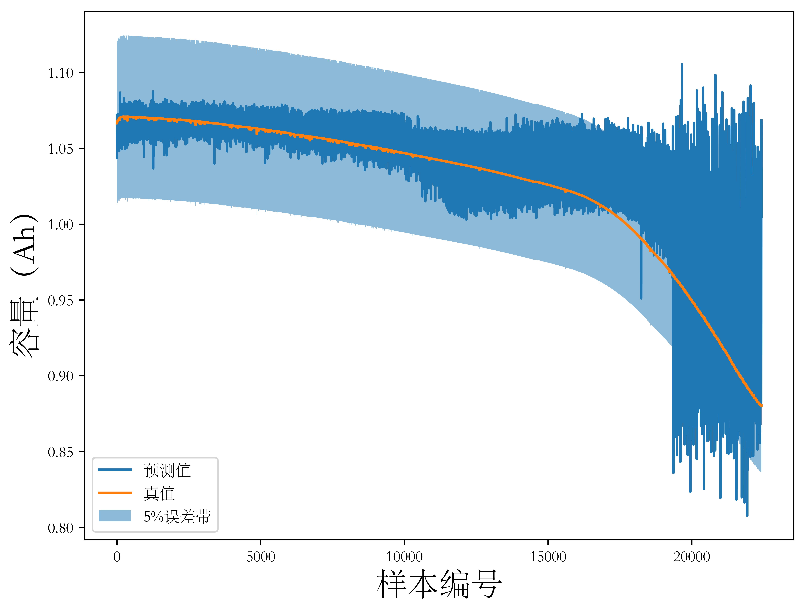
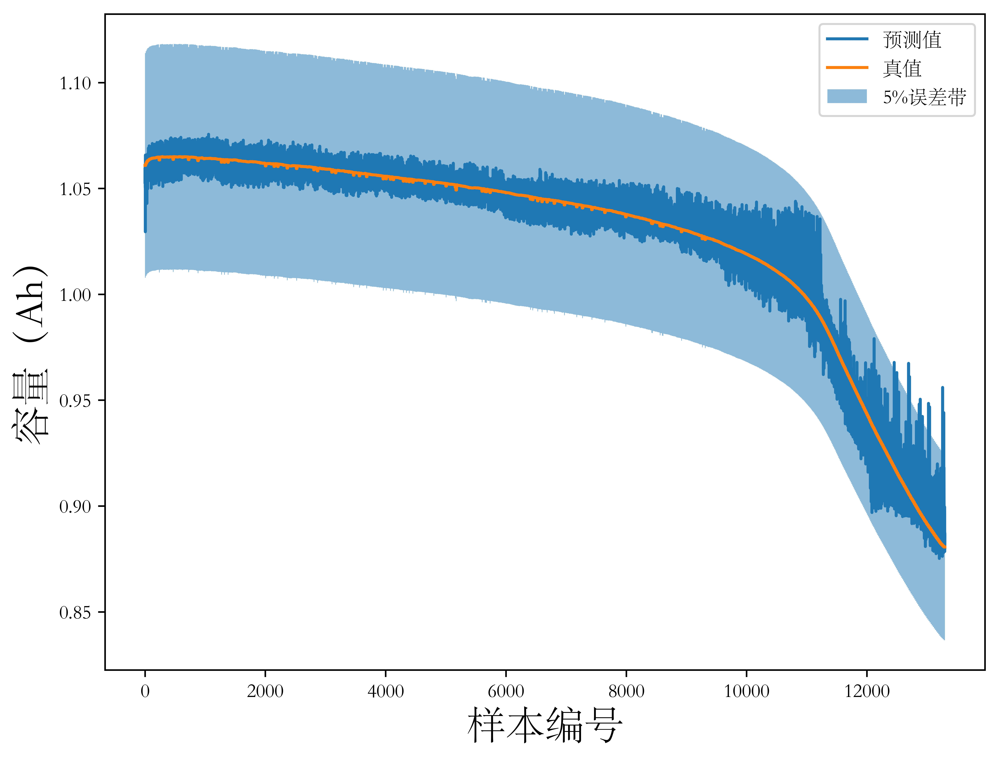
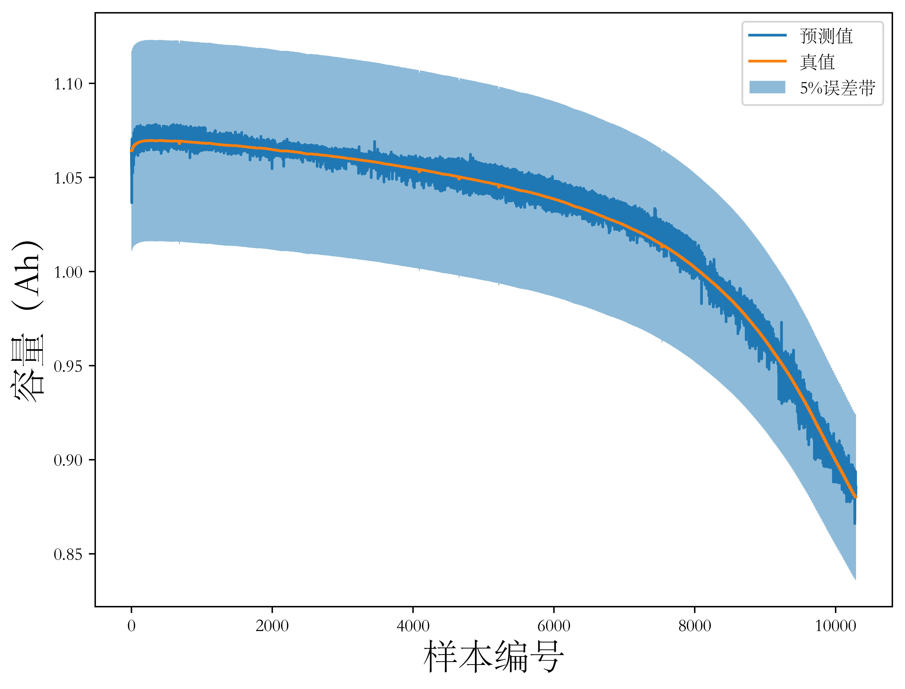

## 4.1 引言

上一章分析了不同模型直接基于电池容量历史数据实现电池健康状态估计的原理和算法性能。这种方法面临以下问题：其一是很难实现锂离子电池的放电容量的非侵入式测量，应用中往往手动构建与电池容量等价的健康因子，通过健康因子映射电池健康状态，但这种健康因子构建与机理模型类似，需要相对详尽的机理模型参与，同时泛化能力有限；其二，使用历史循环数据，无论是直接使用容量数据还是通过健康因子进行时间序列回归，都需要若干周期完整充放电循环数据作为输入。

以上两个问题很大程度地限制了直接使用历史容量退化数据进行电池健康状态估计方法的应用。基于此，本章提出了一种基于锂离子电池充放电过程中直接测量量的电池健康状态估计方法。本章沿用前一章在时间序列上使用的滑动窗口策略并介绍了一种时间序列-图像变换方法进行数据处理，分别使用充放电时测量的电流、电压、温度和电池电荷量作为输入循环测量量作为输入，并基于经典的LeNet-5结构设计了用于电池健康状态估计的CNN模型，在TRI数据上实验并分析其预测性能。

## 4.2 数据预处理：时间序列-图像变换

早期电池健康估计方法研究从电池充电电压数据中手动提取信息构造健康因子（health indicator）以克服电池历史容量数据难以获取的问题。这一方法随着深度学习领域研究的深入演变为将电池充电电压原始数据直接送入注入CNN模型一类结构中以自动实施特征提取。称一个特征（如电压）为一个通道，【文献】比较了使用多通道数据（如电压、电流和表面温度）作为输入和仅使用单通道数据（电压）输入时模型的预测性能，证明前者对提高预测准确度有增益。

构造包含多通道数据的样本，自然地，仿照本文第三章中历史容量数据样本的构造方式，对原始时间序列采用滑动窗口策略可以得到一系列样本。设时间窗口长度为 $w$，则构造的单通道样本形状为 $<(1, w), 1>$，其中 $(1, w)$ 为输入序列，也即特征，表示为行向量，$1$为标签，是一个标量。考虑有三个通道的情形，在三个通道的原始时间序列上分别实施滑动窗口方法，分别生成的单通道样本沿行向量的列方向堆叠，生成形如 $<(3, w), 1>$ 形式的样本，其中 $(3, w)$ 为样本特征，表现为矩阵，$1$ 为样本标签，仍为标量。注意到上一章中针对电池容量退化数据使用滑动窗口方法时，相邻两个滑动窗口间存在重叠，这是使用的时间序列预测方法的“多对一”的输入输出形式决定的，这一特性在将滑动窗口方法作用于多通道数据上时，本质上上作用在电池充放电过程中的若干观测量时间序列上时，仍然可以保留。上一章使用的样本中不同量都是跨循环的，本章讨论的数据预处理方式处理的数据则是循环内的。滑动窗口在一个循环内采集到的数据上有重叠地滑动，一方面使生成的样本数量大大增加，以便给预测模型提供更多的信息，有助于提高模型的预测性能；另一方面提高了模型在预测阶段对输入数据的鲁棒性。以下具体讨论这两方面的优势。

从增加数据量的角度分析，记原始时间序列的长度为 $L$，滑动窗口长度为 $w$，窗口间重叠部分以序列长度表示，记为 $c$，能生成的样本数量记为N，则可建立样本数量与原始序列长度、滑动窗口长度及窗口重叠长度间关系如【式4-1】，式中 $floor$ 记号表示向下取整。

$$ N = floor(\frac{L - w}{w - c}) + 1 \tag{4-1} $$

基于此，结合目前主流电池的循环长度及应用长对测量量时间窗口长度的期望，取 $L = 800$，$w = 200$。当 $c = 0$，即滑动的时间窗口间恰好无重叠时，易求得 $N = 4$，即能生成4条样本；当 $c = 80\% w = 160$，即设置滑动时窗口彼此保留80%重合部分时，易求得 $N = 16$。从而使用有重叠的滑动窗口方法进行数据预处理能实现广义的数据增广。从提高输入鲁棒性的角度分析，考虑到训练模型和应用模型时使用的样本具有相同的形式，意味着模型要依据充放电过程中任意选取的一段连续的时间序列（多通道）确定电池在当前充放电循环的容量值。这样，包含输入数据的时间窗口在时间轴上分布越密集，模型对应用时输入的时间序列的起点越鲁棒。

至此，为实现本章引言中提到的适用于实际场景中的容量估计/健康状态估计方法，应采用多通道时间序列，并在其上实施有重叠的滑动窗口策略。这样构造的具有（特征，标签）形式的样本的特征表现为矩阵，该矩阵行数取决于特征数量（通道数），列数取决于时间窗口长度，也即对具体特征的观测序列的采样数。下一步，这样的样本被作为输入传递给CNN模型。如前章叙述， CNN网络的主要功能是通过卷积操作，将输入转化为特征图。为了从上述样本中提取特征，CNN卷积层中卷积核的设计有多种选择。最自然的一种是沿用一维卷积的思路，设计一种一维形式卷积核，相当于对样本的不同通道数据分别进行卷积，再通过展平和若干全连接层映射到预测的电池容量上。但考虑到可用特征数（通道数）往往较少，而某一通道上的采样点往往较多，使得即使使用较大的卷积核也会使特征图通过第一个全连接层时需要计算的参数量非常大，不利于模型的训练和在低算力平台上的部署。受到CNN通常的处理对象，即图像结构，的启发，不妨将此处的多通道时间序列转化为具有类似图像结构的数据。具体地，将滑动窗口的窗口长度设置为完全平方数，仍记为 $w$，通过重新排列元素，将一个通道上的一维时间序列排布为二维矩阵形式，取该矩阵为方阵，其形状为 $(\sqrt{w}, \sqrt{w})$，建立这里所说的“通道”（实际上是特征）与图像结构中的色彩通道的一一映射，这样将二维结构的电池充放电数据变换为具有三维（宽度，高度，深度）结构的电池充放电数据。将这种变换称为时间序列-图像变换，针对变换后的样本进行卷积神经网络结构设计，不仅解决了上述模型计算量大的问题，同样使得网络中填充（padding）、池化（pooling）结构等的设计有迹可循。

## 4.3 基于卷积神经网络的锂离子电池健康状态间接估计方法

对于输入数据，使用TRI数据集第三个批次（batch3）的前16颗电池充放电循环数据，将其均分为4组，每组包含四颗电池数据。【表4-1】展示了这些电池的分组编号、编号、循环圈数和充电策略。对于充电策略的格式已在第二章中说明，此处从略。依据构造样本时使用的特征量和是否对数据进行时间序列-图像变换将本章实验划分为四组，分别为：1）以充放电过程中的电池电压、电流和电池表面温度为输入，不进行时间序列-图像变换，记为实验一；2）以充放电过程中的电池电压、电流和电池表面温度为输入，进行时间序列-图像变换记为实验二；3）以充放电过程中的电池电压、电流和电池电荷为输入，不进行时间序列-图像变换，记为实验三；4）以充放电过程中的电池电压、电流和电池电荷为输入，进行时间序列-图像变换，记为实验四。设置滑动窗口长度为225（$15\times 15$），滑动窗口的重叠长度为窗口长度的80%，即180。训练时无论实验组号，均使用四组电池数据，具体地，首先对每块电池数据使用滑动窗口处理为（特征，标签）形式样本数据并依据实验是否进行时间序列-图像变换决定是否对样本特征矩阵变换（若不进行变换，样本中特征为3行225列张量；若变换，样本中特征为15行15列3通道张量），取其中一组为训练集，剩余三组按7:3比例划分为训练集和验证集。

<table>
    <caption>表4-1 TRI数据集电池分组</caption>
    <tr>
        <td>电池分组编号</td>
        <td>电池编号</td>
        <td>循环圈数</td>
        <td>充电策略</td>
    </tr>
    <tr>
        <td>1</td>
        <td>1</td>
        <td>1008</td>
        <td>5C(67%)-4C</td>
    </tr>
    <tr>
        <td></td>
        <td>2</td>
        <td>1062</td>
        <td>5.3C(54%)-4C</td>
    </tr>
    <tr>
        <td></td>
        <td>3</td>
        <td>1266</td>
        <td>5.6C(19%)-4.6C</td>
    </tr>
    <tr>
        <td></td>
        <td>4</td>
        <td>1114</td>
        <td>5.6C(36%)-4.3C</td>
    </tr>
    <tr>
        <td>2</td>
        <td>5</td>
        <td>1047</td>
        <td>5.6C(19%)-4.6C</td>
    </tr>
    <tr>
        <td></td>
        <td>6</td>
        <td>827</td>
        <td>5.6C(36%)-4.3C</td>
    </tr>
    <tr>
        <td></td>
        <td>7</td>
        <td>666</td>
        <td>3.7C(31%)-5.9C</td>
    </tr>
    <tr>
        <td></td>
        <td>8</td>
        <td>1835</td>
        <td>4.8C(80%)-4.8C</td>
    </tr>
    <tr>
        <td>3</td>
        <td>9</td>
        <td>827</td>
        <td>5C(67%)-4C</td>
    </tr>
    <tr>
        <td></td>
        <td>10</td>
        <td>1038</td>
        <td>5.3C(54%)-4C</td>
    </tr>
    <tr>
        <td></td>
        <td>11</td>
        <td>1077</td>
        <td>4.8C(80%)-4.8C</td>
    </tr>
    <tr>
        <td></td>
        <td>12</td>
        <td>816</td>
        <td>5.6C(19%)-4.6C</td>
    </tr>
    <tr>
        <td>4</td>
        <td>13</td>
        <td>931</td>
        <td>5.6C(36%)-4.3C</td>
    </tr>
    <tr>
        <td></td>
        <td>14</td>
        <td>815</td>
        <td>5.6C(19%)-4.6C</td>
    </tr>
    <tr>
        <td></td>
        <td>15</td>
        <td>857</td>
        <td>5.6C(36%)-4.3C</td>
    </tr>
    <tr>
        <td></td>
        <td>16</td>
        <td>875</td>
        <td>5.9C(15%)-4.6C</td>
    </tr>
</table>

基于以上对数据输入形式的分析和设计，本节讨论基于电池充放电循环中部分充放电数据的电池容量估计/健康状态估计的模型设计。现代CNN模型随着残差块结构的引入，已经具备很大的堆叠规模，但考虑到电池容量估计问题本身易过拟合的特性及模型在低计算能力嵌入式设备的部署问题，本文选择使用更小参数规模的模型。LeNet5是一种早期的CNN结构，其原生处理的问题即具有较小的分辨率，从而其网络层数少、参数量小同时具有相对较高的预测性能。本节基于LeNet5的结构，依据上节讨论的两种不同形式的输入（即不进行时间序列-图像变换和进行时间序列-图像变换两种情形）设计了两种相似的CNN结构，其每层的具体类型、输出形状和参数量归纳如【表4-2】和【表4-3】，其中对输出形状省略了批大小维度。

<table>
    <caption>表4-2 适用于未进行时间序列-图像变换数据的CNN结构</caption>
    <tr>
        <td>层号</td>
        <td>层类型</td>
        <td>输出形状</td>
        <td>参数量</td>
    </tr>
    <tr>
        <td>1</td>
        <td>卷积层1</td>
        <td>(16, 3, 211)</td>
        <td>256</td>
    </tr>
    <tr>
        <td>2</td>
        <td>池化层1</td>
        <td>(16, 3, 105)</td>
        <td>0</td>
    </tr>
    <tr>
        <td>3</td>
        <td>卷积层2</td>
        <td>(32, 3, 91)</td>
        <td>7712</td>
    </tr>
    <tr>
        <td>4</td>
        <td>池化层2</td>
        <td>(32, 3, 45)</td>
        <td>0</td>
    </tr>
    <tr>
        <td>5</td>
        <td>卷积层3</td>
        <td>(16, 3, 31)</td>
        <td>7696</td>
    </tr>
    <tr>
        <td>6</td>
        <td>卷积层4</td>
        <td>(16, 3, 17)</td>
        <td>3856</td>
    </tr>
    <tr>
        <td>7</td>
        <td>线性层1</td>
        <td>50</td>
        <td>40850</td>
    </tr>
    <tr>
        <td>8</td>
        <td>线性层2</td>
        <td>1</td>
        <td>51</td>
    </tr>
</table>

<table>
    <caption>表4-3 适用于进行时间序列-图像变换数据的CNN结构</caption>
    <tr>
        <td>层号</td>
        <td>层类型</td>
        <td>输出形状</td>
        <td>参数量</td>
    </tr>
    <tr>
        <td>1</td>
        <td>卷积层1</td>
        <td>(16, 14, 14)</td>
        <td>208</td>
    </tr>
    <tr>
        <td>2</td>
        <td>池化层1</td>
        <td>(16, 7, 7)</td>
        <td>0</td>
    </tr>
    <tr>
        <td>3</td>
        <td>卷积层2</td>
        <td>(32, 6, 6)</td>
        <td>2080</td>
    </tr>
    <tr>
        <td>4</td>
        <td>池化层2</td>
        <td>(32, 3, 3)</td>
        <td>0</td>
    </tr>
    <tr>
        <td>5</td>
        <td>卷积层3</td>
        <td>(16, 4, 4)</td>
        <td>2064</td>
    </tr>
    <tr>
        <td>6</td>
        <td>卷积层4</td>
        <td>(16, 3, 3)</td>
        <td>1040</td>
    </tr>
    <tr>
        <td>7</td>
        <td>线性层1</td>
        <td>50</td>
        <td>7250</td>
    </tr>
    <tr>
        <td>8</td>
        <td>线性层2</td>
        <td>1</td>
        <td>51</td>
    </tr>
</table>

具体地，第一种结构使用的输入数据未进行时间序列-图像变换，输入样本的特征是形状为（3，225）的矩阵。这种结构的网络包括4个卷积层，2个池化层和2个全连接层，卷积层统一采用形状为1-15的卷积核，每个卷积层卷积核数量分别为16、32、16和16，池化层采用最大池化策略，池化层滤波器的形状设置为（1，2），步幅同样设置为（1，2）。输入经过两个卷积-池化层堆叠结构后，生成的特征图经过两个全连接层被降维到1，即为模型预测的电池容量。模型每一层使用ReLU激活函数。设置训练数据的批大小为128，训练轮数为120，使用Adam优化器，设置模型损失函数为MSE，设置学习率为0.001。第二种结构接受进行的时间序列-图像变换的样本，输入样本的特征形状为（15，15，3）。第二种结构与第一种结构几乎完全一致，只是为了适应不同形式的输入，将卷积核大小设置为（2，2），将池化层滤波器大小设置为（2，2），步幅则设置为（1，1）。同时为了保持特征图尺寸（保持特征图尺寸大于卷积核尺寸），在第三次卷积前对特征图做零填充（zero padding），填充尺寸为1，训练时的各种设置与第一种结构一致，从略。

## 4.4 实验结果与分析

（数据分组）

如【图4-1】为使用充放电过程中的电压、电流和温度数据，同时不进行时间序列-时间变换直接作为输入时模型在TRI数据集的四个分组上的实验结果。

<figure>
<figcaption>图4-1 V、I、T输入，不进行时间序列-图形变换（第一组）</figcaption>

</figure>

<figure>
<figcaption>图4-2 V、I、T输入，不进行时间序列-图形变换（第二组）</figcaption>

</figure>

<figure>
<figcaption>图4-3 V、I、T输入，不进行时间序列-图形变换（第三组）</figcaption>

</figure>

<figure>
<figcaption>图4-4 V、I、T输入，不进行时间序列-图形变换（第四组）</figcaption>

</figure>

如【图4-2】为使用充放电过程中电压、电流和温度数据先进行时间序列-图像变换再输入模型时模型在数据集四个分组上的实验结果。

<figure>
<figcaption>V、I、T输入，进行时间序列-图形变换（第一组）</figcaption>

</figure>

<figure>
<figcaption>V、I、T输入，进行时间序列-图形变换（第二组）</figcaption>

</figure>

<figure>
<figcaption>V、I、T输入，进行时间序列-图形变换（第三组）</figcaption>

</figure>

<figure>
<figcaption>V、I、T输入，进行时间序列-图形变换（第四组）</figcaption>

</figure>

如【图】为

<figure>
<figcaption>V、I、q输入，不进行时间序列-图形变换（第一组）</figcaption>

</figure>

<figure>
<figcaption>V、I、q输入，不进行时间序列-图形变换（第二组）</figcaption>

</figure>

<figure>
<figcaption>V、I、q输入，不进行时间序列-图形变换（第三组）</figcaption>

</figure>

<figure>
<figcaption>V、I、q输入，不进行时间序列-图形变换（第四组）</figcaption>

</figure>

如【图】为

<figure>
<figcaption>V、I、q输入，进行时间序列-图形变换（第一组）</figcaption>

</figure>

<figure>
<figcaption>V、I、q输入，进行时间序列-图形变换（第二组）</figcaption>

</figure>

<figure>
<figcaption>V、I、q输入，进行时间序列-图形变换（第三组）</figcaption>

</figure>

<figure>
<figcaption>V、I、q输入，进行时间序列-图形变换（第四组）</figcaption>

</figure>

## 4.5 本章小结

本章沿用前文使用的滑动窗口方法进行锂离子电池充放电循环数据分段，直接将将分段数据作为样本，一方面实现了数据增广，满足了深度神经网络的训练过程对数据量的需求，另一方面为CNN模型对输入数据的鲁棒性奠定基础，很大程度上使得网络对任意起点（相对充放电周期而言）的输入数据都能得到准确的估计结果。其次，本章介绍了一种时间序列到图像变换方法，满足了直接基于原始循环过程测量量（电流、电压、电池表面温度和电荷量）进行状态估计的要求，同时使得CNN模型能更好地利用输入数据的时空相关性、提高模型预测精度并简化模型的设计难度和计算复杂度。最后，本章基于上述预处理步骤，提出一种结构简单、性能优异的CNN网络结构，建立了更符合应用需求的锂离子电池健康状态估计模型，消除了对锂离子电池工作机理相关的先验领域知识的需要，同时，模型可以自主学习其参数和权重（离线模型更新），并基于训练结果实现快速的精准的在线健康状态估计（在线模型应用）。

本文进行了四组实验，分别是：1）以电压、电流和温度数据为输入，不进行时间序列-图像变换的实验，2）以电压、电流和温度数据为输入，进行时间序列-图像变换的实验，3）以电压、电流和电池电荷量为输入，不进行时间序列-图像变换的实验和4）以电压、电流和电池电荷量为输入，进行时间序列-图像变换的实验。实验在TRI数据集上进行，统计并对比模型预测精度和模型参数量。实验结果表明，使用电池电荷量替换电池温度作为模型输入可以显著提高模型预测精度（结合具体实验结果说明），而使用时间序列-图像变换能一定程度上提高模型性能（结合具体实验结果说明），同时显著降低模型参数量（结合具体实验结果说明），为模型在实际车机系统上的部署奠定了基础。