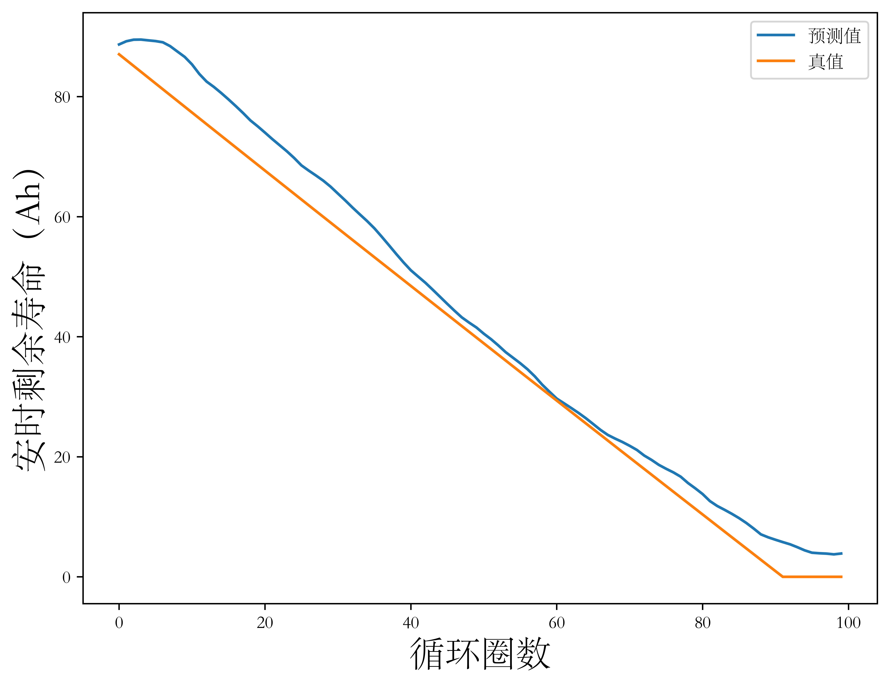

## 5.1 引言

如本文绪论所述，电池寿剩余寿命由电池健康状态定义，而目前通常使用的电池健康状态由电池放电容量定义。第三章和第四章集中讨论电池健康状态/电池放电容量估计问题。本章在第三章和第四章的基础上讨论电池剩余寿命预测问题，介绍了常用的以循环圈数定义的电池剩余寿命及其应用局限性，并据此介绍以容量定义的电池剩余寿命，称为安时-剩余寿命（Ah-RUL）。进一步地，基于LSTM网络基本结构构建深度LSTM电池Ah-RUL预测模型，在Unibo Powertools数据集上训练并测试。

## 5.2 剩余寿命定义

电池剩余寿命（Remaining Useful Life，RUL）的定义已在本文绪论中介绍，彼时介绍的RUL基于电池充放电循环计数，为了与下文中讨论的另一种剩余寿命定义区分，称上述定义为电池的循环剩余寿命（cycle-RUL）。为了获取电池的循环剩余寿命，文献普遍采用以下两种策略。其一基于电池全生命周期放电容量序列，通过给定失效阈值，可知电池在某个循环达到寿命终止状态（End of Life，EOL），设在第 $n_{EOL}$ 循环电池失效，当前循环为 $n_{current}$，即为即可得循环剩余寿命定义如【式5-1】。

$$ RUL_{cycle} = n_{EOL} - n_{current} \tag{5-1} $$

不妨将这种策略称为后处理（post-process）策略。另一在数据预处理步骤完成剩余寿命生成，这种生成方式以电池真实容量退化序列取代上述过程中的预测容量退化序列，生成电池全生命周期每一次充放电循环对应的剩余寿命，将此寿命作为样本标签送入数据驱动模型，模型输出即为剩余寿命预测值,类似地，称这种处理策略为前处理（pre-process）策略。注意到后处理策略要求完整的预测容量退化序列，若采用本文第三章使用的时间序列回归模型，只需前若干循环数据即可生成所需序列，但若采用本文第四章使用的基于充放电过程直接观测数据的预测模型，在充放电过程实施前无法获得对应的循环的容量预测信息，无法生成所需序列。考虑到基于直接观测量的预测模型更具现实意义，本章讨论的剩余寿命预测方法采用前处理策略。

## 5.3 基于长短期记忆神经网络的锂离子电池剩余寿命估计方法

首先说明模型的数据输入。使用UNIBO Powertools数据集，该数据集中的电池按照采用的充放电策略被划分为三种类型，分别为标准类型（Standard，S）、高电流类型（High Current，H）和带预处理步骤类型（Pre-conditioned，P），三种类型具体采使用的充放电策略已在第二章第四节中说明，这里不再赘述。上述类型使数据集中电池分组的最重要依据，也是本章实验中最关注的差异。电池实际的分组命名依据更多信息，其形式为XW-C.C-AABB-T，其中X表示电池制造商，W表示电池用途，C.C记录电池额定容量，AABB记录电池的出厂日期，T表示电池的实验类型。其中除电池实验类型外的其他参数不是本实验关注的充电，其具体可取值不做介绍。基于此，将本章中使用的电池数据归纳如【表5-1】，每个电池分组中取一颗电池数据作为测试集，测试集包含7颗电池的数据，剩余电池作为训练集，训练集中包含20颗电池的数据，本章实验不使用验证集，某些分组中有部分电池的观测数据有误，这些电池的数据将被舍弃，不参与实验。每颗电池所属测试集/训练集分组及其舍弃情况同样总结于【表5-1】。

<table>
    <caption>表5-1 数据集划分</caption>
    <tr>
        <td>电池描述</td>
        <td>训练集电池编号</td>
        <td>测试集电池编号</td>
        <td>说明</td>
    </tr>
    <tr>
        <td>DM-3.0-4019-S</td>
        <td>000、001、002</td>
        <td>003</td>
        <td></td>
    </tr>
    <tr>
        <td>DM-3.0-4019-H</td>
        <td>009、010</td>
        <td>011</td>
        <td></td>
    </tr>
    <tr>
        <td>DM-3.0-4019-P</td>
        <td>014、015、016、017</td>
        <td>013</td>
        <td>047、049电池数据舍去</td>
    </tr>
    <tr>
        <td>EE-2.85-0820-S</td>
        <td>007、008、042</td>
        <td>006</td>
        <td></td>
    </tr>
    <tr>
        <td>EE-2.85-0820-H</td>
        <td>043</td>
        <td>044</td>
        <td></td>
    </tr>
    <tr>
        <td>DP-2.00-1320-S</td>
        <td>018、036、038、050、051</td>
        <td>039</td>
        <td>019电池数据舍去</td>
    </tr>
    <tr>
        <td>DM-4.00-2320-S</td>
        <td>040</td>
        <td>041</td>
    </tr>
</table>

基于第四章讨论，仍使用充放电过程中的直接观测量作为模型输入。具体地，为充放电过程中的电压、电流和电池表面温度，考虑到UNIBO Powertools数据集中充放电过程数据采样频率设置的相当高，处理时取若干秒为一个采样区间，取该采样区间中所有采样点的观测值的均值和标准差，3个观测量在1个采样区间中生成6个统计量作为特征，仍采用滑动窗口方法，将窗口长度设置为500。预测模型的输入样本的形状即为（500，6），原始序列的首端数据无法生成如此长的样本，构造样本时采用零填充（zero padding）策略补齐，输入网络后再使用掩膜层（masking layer）处理获取真实数据。

本章引入深度LSTM网络实现剩余寿命预测，基于第三章第二节介绍的LSTM网络基本结构，深度LSTM模型堆叠了若干LSTM层，将前一层输出 $Y_{t}$（或前一层隐状态 $H_{t}$，两者等价）作为下一个LSTM层的输入。本章使用的深度LSTM网络结构、每一层类型、输出形状和参数量如【表5-2】所示，表中省略了对样本批大小的记录。具体地，输入数据首先经过掩膜层（masking layer）去除为使样本具有等长形式填充的0元素，继而经过两个LSTM层，两个LSTM层分别具有128个和64个LSTM记忆单元（神经元），样本序列经过LSTM层生成的特征序列继续经过由三个全连接层构成的多层感知机降维到标量输出，该输出即为预测的电池安时剩余寿命三个全连接层的神经元数量分别为64、32、1。

（网络细节介绍）

selu激活函数

L2正则化

设置训练批大小为32，训练轮数为500。

使用Adam优化器，使用huber损失函数，设置学习率为0.000003。

<table>
    <caption>表5-2 用于RUL预测的DeepRUL网络结构示意图</caption>
    <tr>
        <td>层号</td>
        <td>层类型</td>
        <td>输出形状</td>
        <td>参数量</td>
    </tr>
    <tr>
        <td>1</td>
        <td>masking层</td>
        <td>(500, 6)</td>
        <td>0</td>
    </tr>
    <tr>
        <td>2</td>
        <td>LSTM层１</td>
        <td>(500, 128)</td>
        <td>69120</td>
    </tr>
    <tr>
        <td>3</td>
        <td>LSTM层２</td>
        <td>64</td>
        <td>49408</td>
    </tr>
    <tr>
        <td>4</td>
        <td>全连接层１</td>
        <td>64</td>
        <td>4160</td>
    </tr>
    <tr>
        <td>5</td>
        <td>全连接层２</td>
        <td>32</td>
        <td>2080</td>
    </tr>
    <tr>
        <td>6</td>
        <td>全连接层２</td>
        <td>1</td>
        <td>33</td>
    </tr>
</table>

## 5.4 实验结果分析

<figure>
<figcaption>图5-1</figcaption>

</figure>

考虑到实际电池的充放电策略严格遵从满充满放，应用中电池实际循环圈数并不容易确定。但是基于本文 第四章讨论结果，容易通过电池部分充放电段的直接观测数据估计电池放电容量，从而以上使用电池循环圈数作为横坐标建立的安时剩余寿命-循环圈数寿命可以进一步借助循环圈数和电池放电容量/电池健康状态映射生成电池的安时剩余寿命-电池实际容量映射关系。

<figure>
<figcaption>图5-2</figcaption>

</figure>

## 5.5 本章小结

本章讨论了电池剩余寿命的定义和生成过程，介绍了一种新的基于容量的电池剩余寿命定义。